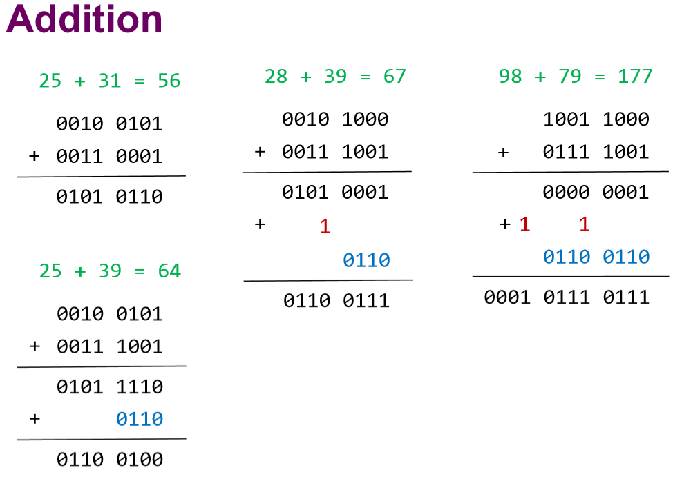
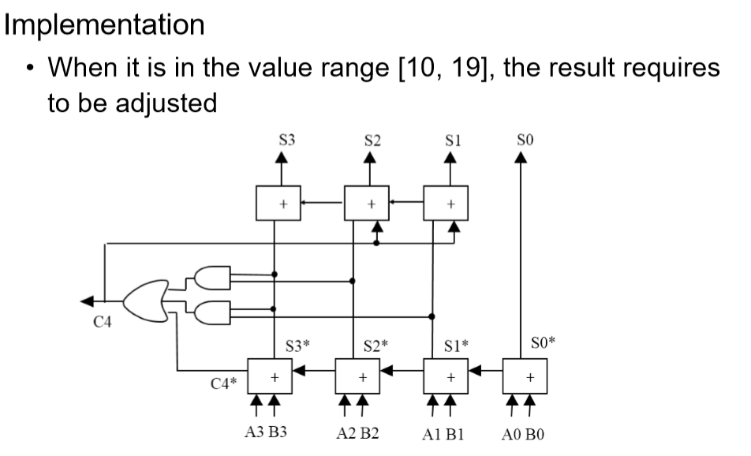
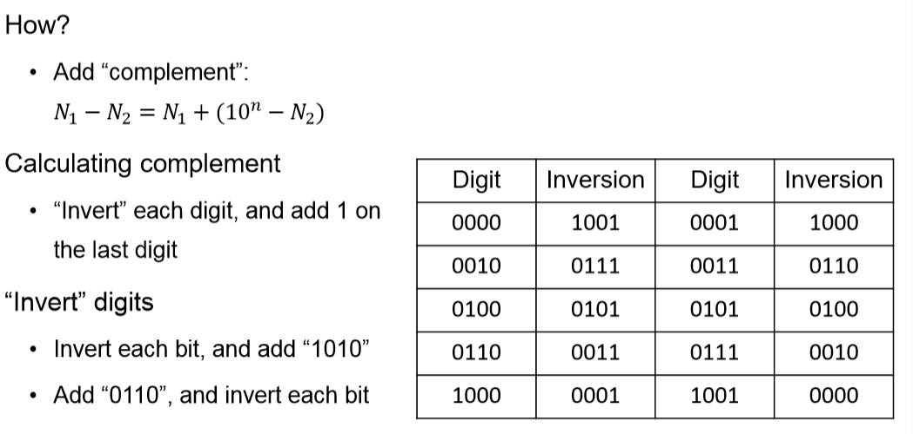

**Decimal Representation**
---
<!-- TOC -->

- [1. 加法的问题(W8421)](#1-加法的问题w8421)
- [2. 实现加六的电路](#2-实现加六的电路)
- [3. 实现减法](#3-实现减法)

<!-- /TOC -->

# 1. 加法的问题(W8421)

1. 4位表示的是16进制的数字
2. 为什么会加6就正常了呢？
    + 因为当满10时需要加6来进行进位
    + 红色的1代表16，但是我们按照10来进行的进位。
    + 只可能出现一次加6，因为最大的是9+9是18，而不会是26，所以最多加1次

# 2. 实现加六的电路

1. C4线上为1，则加6
2. 如何判断存在16进行进位:C4*
3. 如何判断这个电路能达到10及以上的但是不到16的。
    + 判断:最高位为1，第二位、第三位至少有一位不为0即为大于等于10的数字。

# 3. 实现减法

1. 借位是需要解决的。
2. 以67-34为例:
    1. 67-34 = 67 + (100-34) - 100
    2. 100 - 34 = 99 -34 + 1
    3. 接下来解决 9 - 3 && 9 - 4
        + 这个部分就是invert后的数字。
    4. 1001 - 0011 = 1111 - (0011 + 0110) 也可以先取反再加1
3. 忽略掉进位即可，因为已经完成了进位操作。
    + 还不上怎么办:取反加一再加上一个负号
    + 如果还不上:我们依旧需要还上:x-10n = x - 99...9 - 1 = -(99...9 - X + 1)