**Floating-point Arithmetic**
---
<!-- TOC -->

- [1. Float类型变量的表示](#1-float类型变量的表示)
- [2. 加减运算](#2-加减运算)
    - [2.1. 加减的过程](#21-加减的过程)
    - [2.2. 问题出现](#22-问题出现)
    - [2.3. 关键步骤:带符号的数字如何直接相加？](#23-关键步骤带符号的数字如何直接相加)
        - [2.3.1. 几个例子](#231-几个例子)
- [3. 乘除运算](#3-乘除运算)
- [4. 除法运算](#4-除法运算)
- [5. 浮点数的精度问题](#5-浮点数的精度问题)
    - [Rounding](#rounding)
        - [舍弃策略](#舍弃策略)
        - [问题来了:保护位用没有可能让你运算的结果更加不正确](#问题来了保护位用没有可能让你运算的结果更加不正确)

<!-- /TOC -->

1. 对于浮点数而言，乘除是比较简单的，但是加减是困难。

# 1. Float类型变量的表示

浮点数表示的定义
---
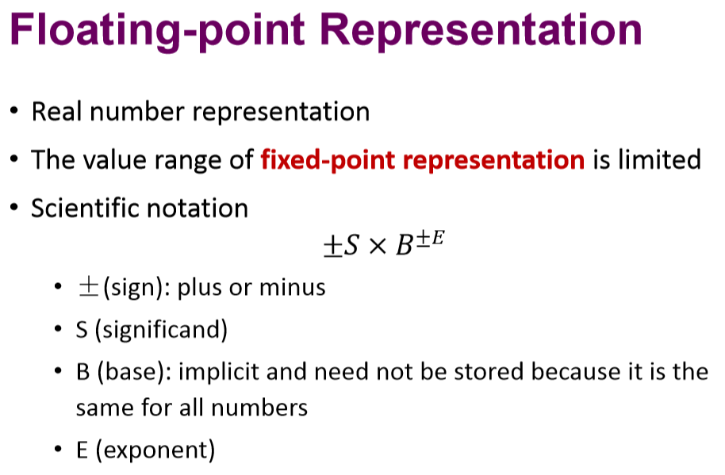

浮点数的表示方法
---
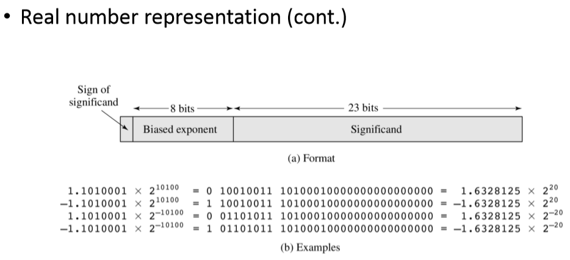

浮点数的表示
---
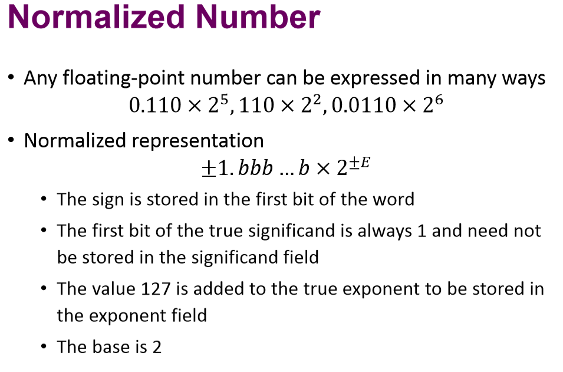

浮点数的表示范围
---
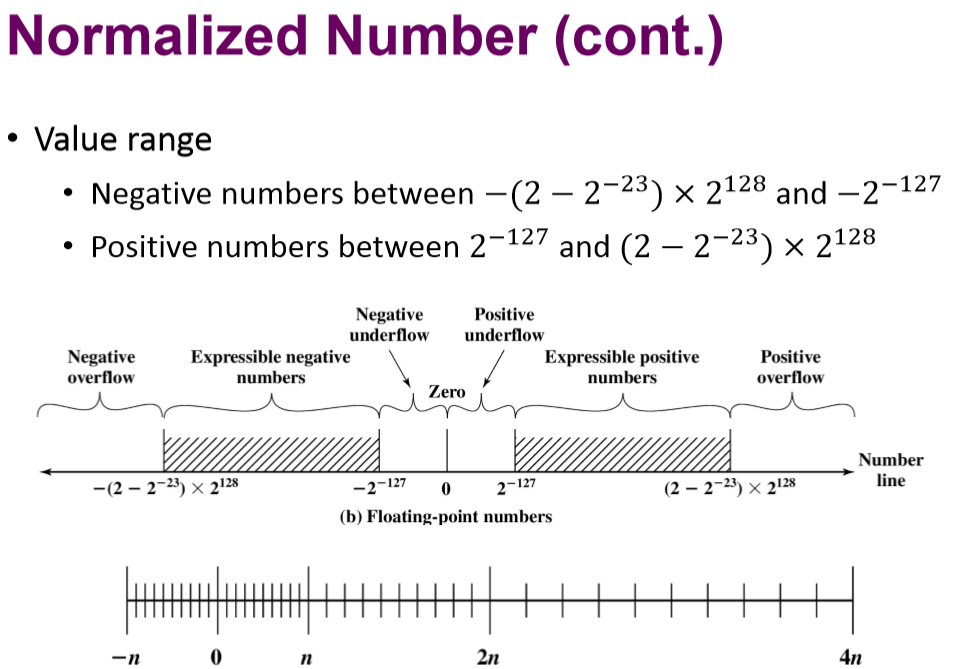

# 2. 加减运算

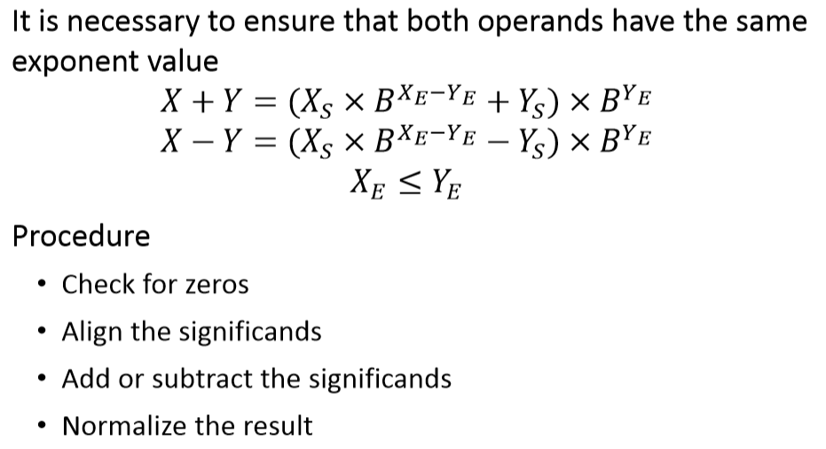

1. 加减首先要想办法把两个小数点对齐
2. 对齐方式:一定是小的向大的靠近，而不是大的向小的部分靠近。
    + 我们怕的是向大的调整会出现上溢。

## 2.1. 加减的过程

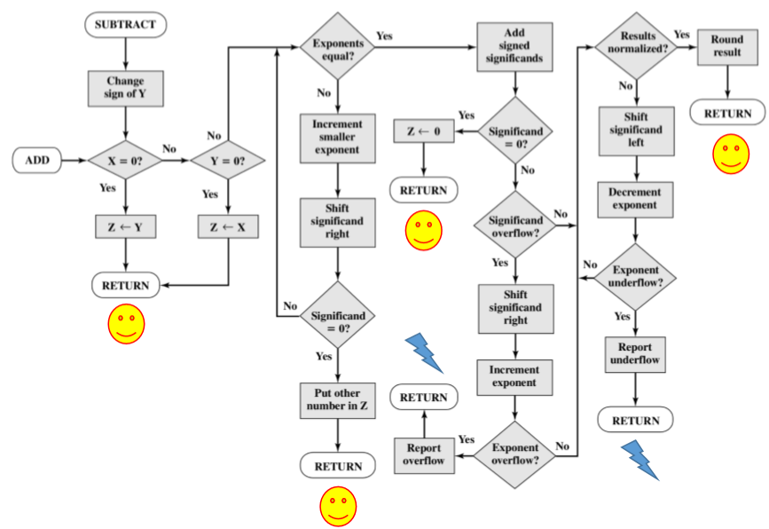

1. Add signed significands：表示需要根据正负号来进行运算，如果是正号那么直接加，如果是负号，那么进行减法。
    + 参与运算的尾数是64位，而不是32位。
2. 发现尾数是0，我们判断他是0，我们需要把它的指数设置为0，在进行加法运算后，如果是两个相反数相加，那么需要将指数位清0。
3. significand是尾数。

## 2.2. 问题出现

尾数溢出
---

1. 如果1.00...0加上1.00...0进位，那么我们需要右移指数自加。

指数溢出
---
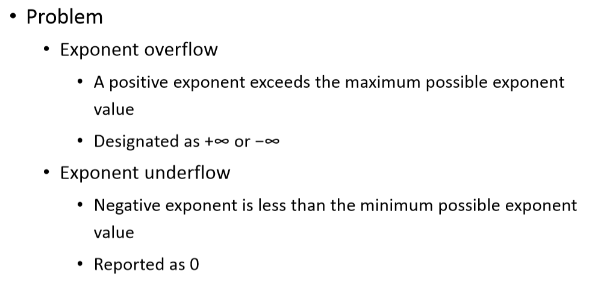

1. 如果溢出，我们要把s设为全0,指数变化为全1(E=127,E是减去127后的)

结果规格化
---
1. 将s左移，保证规格化(当两个数字很接近的时候)
    + 1.11111-1.11110
2. 问题出现:
    + 如果减法过于接近的话，结果可能降低到2-127以下
    + 反规格化时，便表示过小，指数退1(-126和-127，也该是s/2)，也就是1.00...0转换成0.00...0这样子

## 2.3. 关键步骤:带符号的数字如何直接相加？

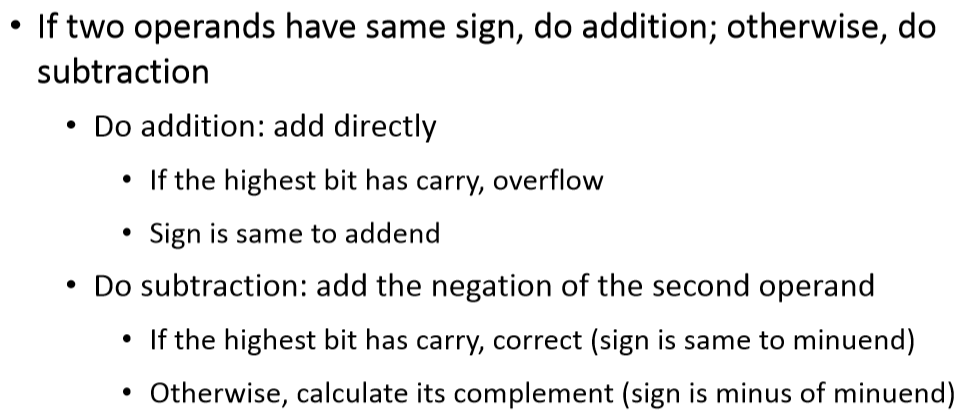

1. 加法的时候，我们只要把符号拿出来相加，然后后面相加即可
2. 减法的时候，我们可以先借位。(X-Y=X+2-Y-2)
    + 2 = 1.11...1 +0.00...1
    + 先借位2，然后如果产生进位，那么直接还掉2即可
    + 如果不够减，那么最后仍需要进行取反加一，然后在前面添加一个负号，和之前的(X-Y)整体外面的部分的符号作用。

### 2.3.1. 几个例子

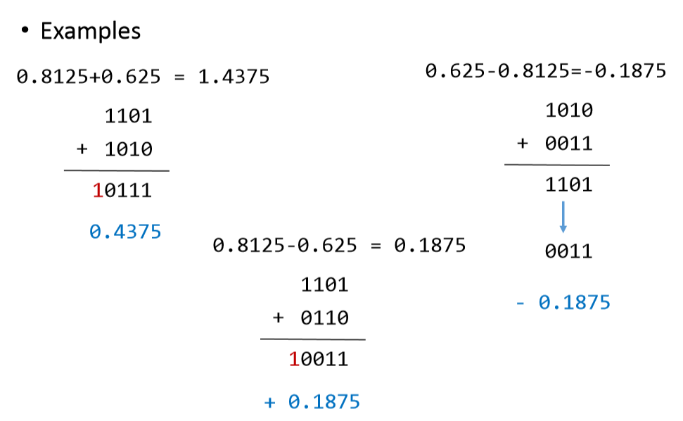

1. 减法要借位，最后要确定能不能还上

减法的例子
---
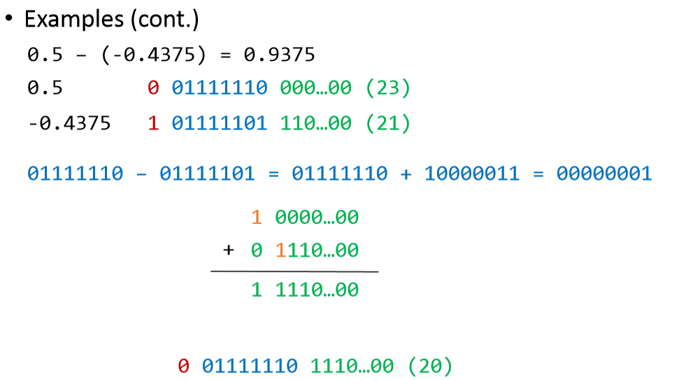

1. 符号不同
2. 第二个右移指数为变大，将缺省的数字添加起来
    + 1.00..00 + 0.11100...0
    + 绿色部分的第一个数字是缺省位

加法的例子
---
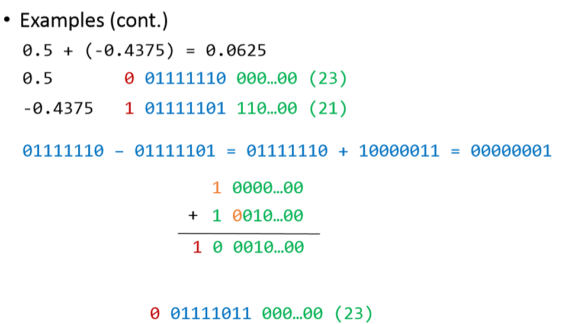

1. 对齐后进行有符号整数的相加
2. 就是首先对齐指数位，下面变成0 111000...0,然后有符号整数相加，先取反加一为1 001000...0
3. 接下来可以之后，我们需要进行规格化，因为比较小。
4. 减法需要借位，最后进行判断。

# 3. 乘除运算

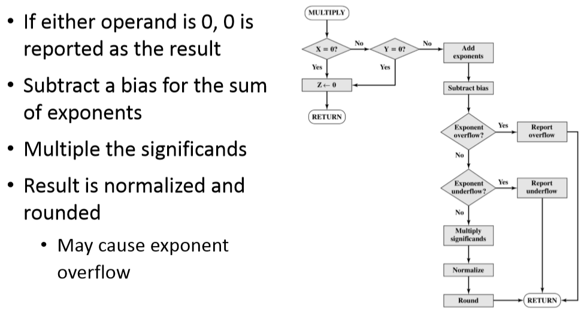

1. 首先我们进行异或运算
2. X*Y = (a1异或a2) s1*s2*2e1+e2
    + e1 = E1 - 127
    + e2 = E2 - 127
    + E1 + E2 - 127 = E* = e1 + e2 + 127

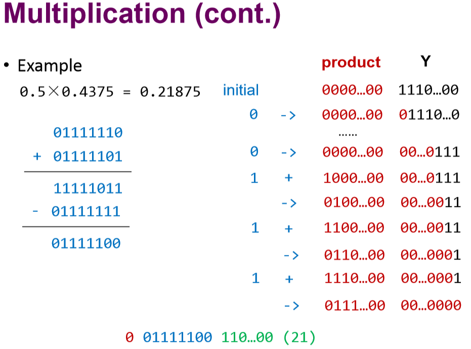

3. 接下来s1*s2
    + 小数点应该在第一个后面
    + 减去了127
4. 左侧是指数位运算，也就是指数一+指数二-127

# 4. 除法运算

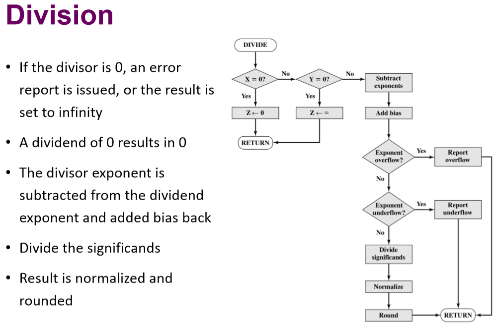

1. 同样127会被减去，所以需要加回来，在调整指数的时候

# 5. 浮点数的精度问题

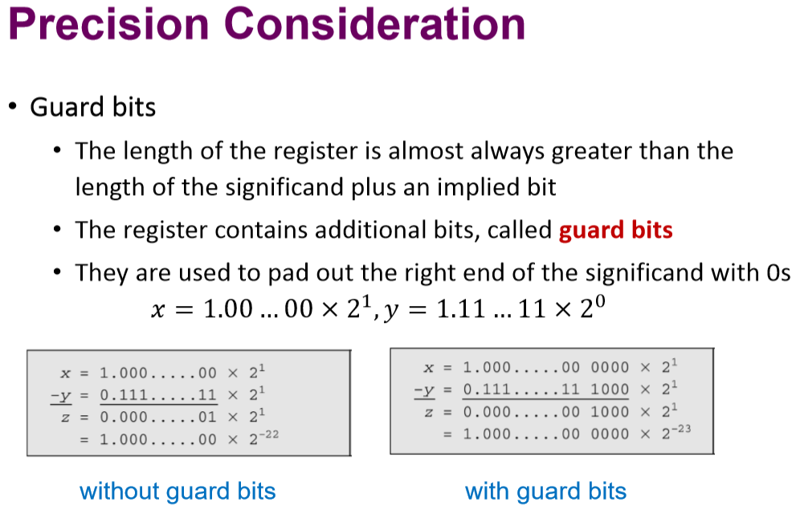

1. 有一些数字是不能被准确正好的表示的。
2. y比x小2-23。
3. 在运算过程中1会被丢掉
    + 首先对齐，那么y的整体会下移，然后最后一位的1被丢掉了
    + 相当于表示精度的位数刚好被丢掉了
4. 问题产生了，那么我们怎么去解决呢？我们使用guard bits也就是扩展到28位存储，防止精度丢失
    + guard bits:保护位

## Rounding
1. 我们有了保护位，但是之后的保护位被舍去的时候，我们怎么处理保护位中仍存在的部分呢？
2. 我们可以直接截取:总体来说这个数字是向0靠近

### 舍弃策略
1. 向正无穷:负数尾数全部截，正数尾数进位
2. 向负无穷:正数尾数全部截，负数尾数进位
3. 向0靠近
4. 四舍五入:
    1. 最后4位，如果第一位是0，那么直接截去。
    2. 最后4位。如果第一位是1，那么我们产生进位。

### 问题来了:保护位用没有可能让你运算的结果更加不正确

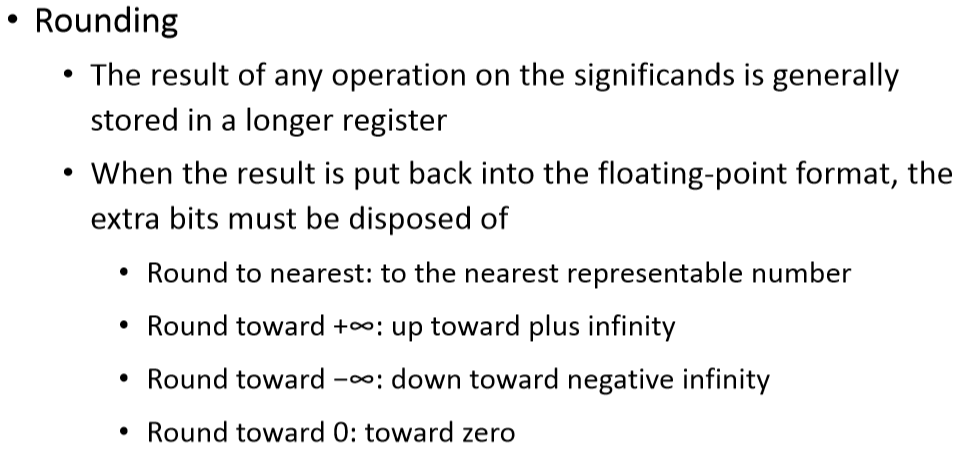

接下来我们进行分别计算
---

加法
---
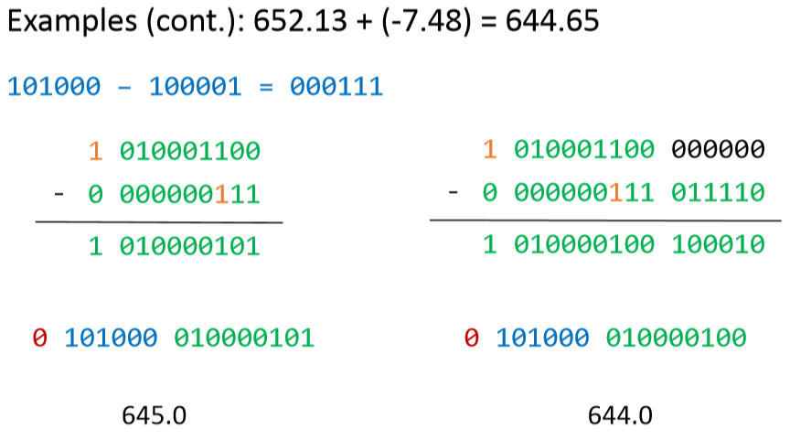

1. 保护位6位，因为一共16位，符号为1位，数字9位
2. 如果用四舍五入就没问题了
3. 为什么有了保护位，精度反而下降了？
    + **保护位保护的是652.0和7.4765625这里面的数字，而未必是原来数字的精度**