**External Memory**
---
1. 外部储存位于存储层级的底部。

<!-- TOC -->

- [1. 外部存储](#1-外部存储)
    - [1.1. 磁盘(Magnetic disk)](#11-磁盘magnetic-disk)
        - [1.1.1. 磁头](#111-磁头)
        - [1.1.2. 磁盘结构](#112-磁盘结构)
        - [1.1.3. 柱面](#113-柱面)
        - [1.1.4. 读写数据需要的时间](#114-读写数据需要的时间)
    - [1.2. 磁头寻道策略](#12-磁头寻道策略)
- [2. Optical Disk(光盘)](#2-optical-disk光盘)
    - [2.1. CD and CD-ROM](#21-cd-and-cd-rom)
        - [2.1.1. 读写](#211-读写)
        - [2.1.2. 区别以及优缺点](#212-区别以及优缺点)
    - [2.2. CD-R and CD-RW](#22-cd-r-and-cd-rw)
    - [2.3. DVD](#23-dvd)
    - [2.4. High-Definition Optical Disk](#24-high-definition-optical-disk)
- [3. 磁带(Magnetic Tape)](#3-磁带magnetic-tape)

<!-- /TOC -->

# 1. 外部存储
1. 我们为什么需要外部储存？
    + 我们需要一些非易失性的存储部分。
2. Characteristics 特点
    + Store large scale data, which may be not always used(存储不经常被用到的大规模数据)
    + Not volatile(非易失性)
3. Types
    + Magnetic disk(磁盘)
    + Optical memory(光盘)
    + Magnetic tape(磁带)
    + USB flash disk, solid state disk (SSD): flash

## 1.1. 磁盘(Magnetic disk)
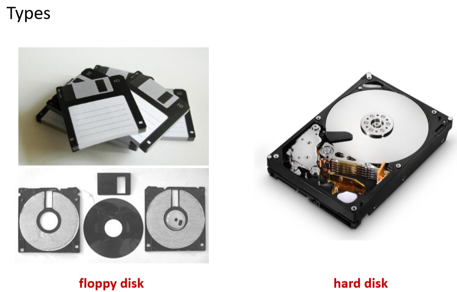

1. 软盘:
    + 特点:比较容易坏。

2.  A disk is a circular platter constructed of nonmagnetic material (substrate) coated with a magnetizable material(磁盘是一个圆形的盘片，由涂有可磁化材料的非磁性材料（基底）构成 )
    + Substrate(基底): aluminum, aluminum alloy material, glass, …(铝，铝合金材料，玻璃，… )
    + Benefit of glass substrate(**玻璃基底的好处**)
        + Improvement in the uniformity of the magnetic film surface to increase disk reliability(改善磁膜表面均匀性提高磁盘可靠性)
        + A significant reduction in overall surface defects to help reduce read-write errors(显著减少整体表面缺陷，有助于减少读写错误)
        + Ability to support lower fly heights(拥有支持更低飞行高度的能力)
        + Better stiffness to reduce disk dynamics(更好的刚度以减少磁盘动力问题)
        + Greater ability to withstand shock and damage(更强的抗冲击和损坏能力)
3. 修正:黑色的是防止磁头打出去的，而下面的才是磁头。

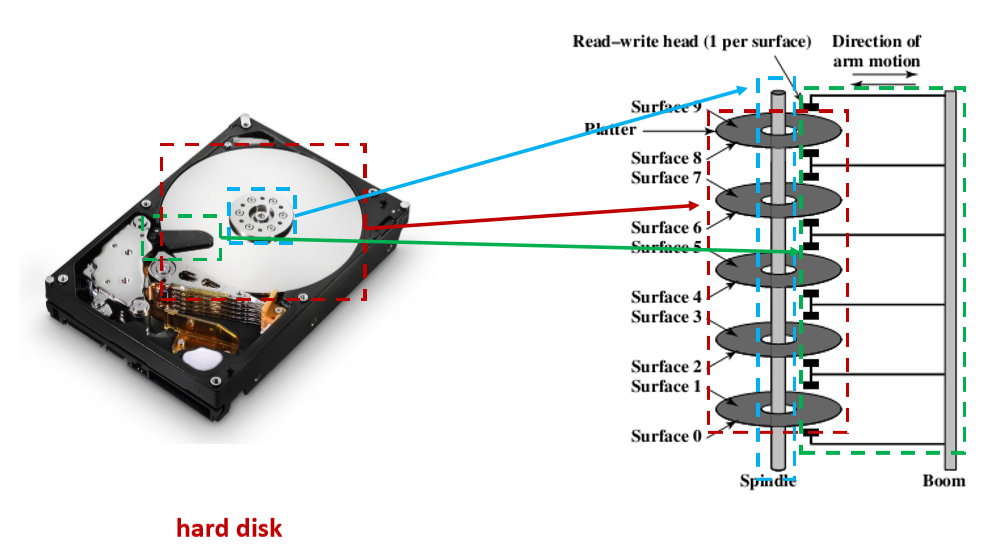

4. 一般来说现在的硬盘大概是1-2块磁盘
    + 磁盘数量比较多，如果两个盘比较近有可能会被破坏。
    + 现在已经是双向读出写入。

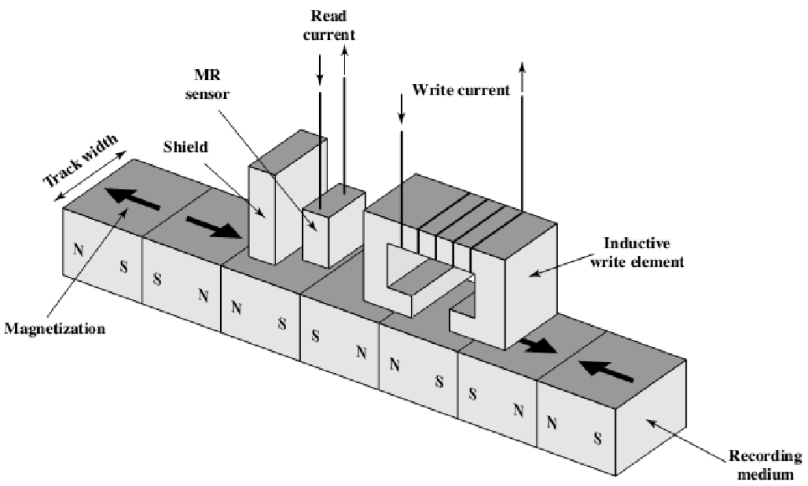

5. Read and write mechanism(读写机器)
    + Read and write operation conduct coil named the head(读写操作使用线圈)
    + During a read or write operation, the head is stationary while the platter rotates beneath it(在读写过程，磁头是静止的，而磁盘是旋转的)
    + Number of head(磁头数量)
        + Single: read and write share one head (floppy disk, older rigid disk)(一个:读写使用一个磁头。软盘，旧的硬盘使用)
        + Two: use a separate read head (contemporary rigid disk)(两个磁头:分开读写磁头:现代刚性硬盘)
    + 因为NS极的不同，那么产生的**感应电流的方向**出现不同，分别代表0和1。这样子就实现了读出。
6. Read Current是一个**电阻随磁场变化**的电阻，在其中加入恒定电流来检测电压变化即可。
    + 这个就可以进行读出。
7. Write current就是来写入信息。
    + 总体上来讲，读的时候比较慢，写的时候比较快。
    + 改变电流方向，导致对于磁盘磁化方向改变。
8. 一般来看，我们的磁头距离磁盘越近(飞行高度低)，则磁头小，精度高。
9. 读写速度由转动的盘决定

### 1.1.1. 磁头
1. 磁头越小,则1 bits存储的大小就更小，整体的数据的大小就更大。
2. 为增加数据量，我们通常将圈变窄，使得相应的磁头变小。

### 1.1.2. 磁盘结构
1. Data organization(数据结构)
    + The organization of data on the platter in a concentric set of rings, called  **track**s(磁盘上的数据组织成一组同心圆，被称为**磁道**) 磁道编号是最外面是0，最里面是大的数字
    + Data are transferred to and from the disk in **sector**s(数据被传向和传出磁盘的**扇区**)
        + Usually 512 B
    + Adjacent tracks are separated by **gap**s, and adjacent sectors are separated by intratrack (intersector) gaps(相邻的**磁道**被**间隔**分隔开，相邻的**块区**之间用**轨内间隙**分隔开)
2. Constant angular velocity (CAV)(恒定角速度)
    + Increase the space between bits to make the disk be scanned at a fixed speed(增加了每一位之间的空间来保证磁盘被以恒定的速度读取)
    + Advantage: individual blocks of data can be directly addressed by track and sector(优点:单个数据块可以通过磁道和扇区直接寻址)
    + Disadvantage: disk storage capacity is limited by the maximum recording density achieved on the innermost track(缺点:磁盘存储容量受最内层轨道上最大记录密度的限制。浪费了外部磁道的空间)
3. Multiple zone recording(多个区域记录)
    + Divide the surface into a number of concentric zones, the number of sectors per track is constant in each zone, and zones farther from the center contain more sectors than zones closer to the center(将曲面划分为多个同心分区，每个分区中每条轨迹的扇区数是恒定的，并且距离中心较远的分区包含的扇区数多于距离中心较近的分区)
    + Advantage: increase storage capacity(优点:增加储存容量)
    + Disadvantage: require more complex circuitry(缺点:需要更加复杂的旋转模式)

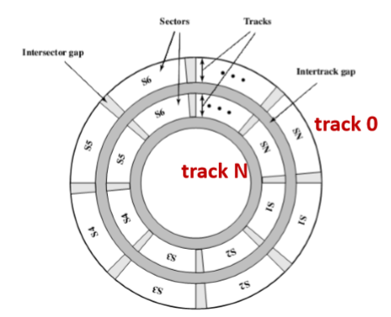

2. 每一个扇区存储的数据量是一样的，通常是**512B(记住)**，所有的磁道都是同心圆。

第一种扇区划分方式
---
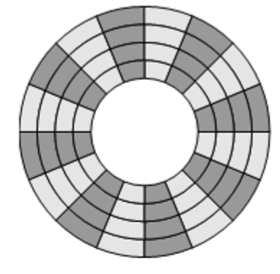

1. 我们的磁盘需要保证读写速度恒定
2. 在当前划分的情况下，磁盘转起来只要保证角速度恒定即可。(结构简单的原因)

第二种扇区划分方式
---
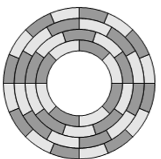
1. 里面扇区的角速度更大，外面扇区的角速度更小。磁盘利用率变高，但是磁盘旋转的装置比较复杂。
2. 实际上更多的是我们将磁盘划分为几个区，不同区之间的速度不同，**在一个区内是第一种扇区划分方式，而不是以磁道为单位**。
    + **几个磁道组成一个区**，而并不是一个磁道一个区
3. 为保证数据读写的速度保持稳定，所以导致了不同区的转动速度不同

两种扇区划分的区别
---
1. 每个扇区存储的数据量是相同的，但是在第二种划分的情况下每一个磁道的数据量是不同的。
    + 为什么?因为每个磁道的扇区的个数是不一样的。
    + 第二种划分的情况下，扇区的长度不都一样的(因为他是多个磁道分为一个区，这个区每个轨道的扇区里面显然长度不同):在一个区里面划分的越靠里越短。
    + 第二种划分在每个分区内按照第一种划分进行处理

### 1.1.3. 柱面
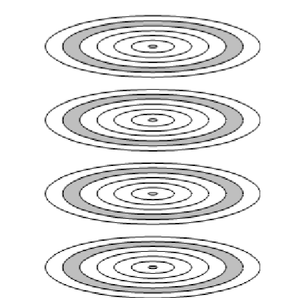

1.  The set of all the tracks in the same relative position on the platter is referred to as a **cylinder**(柱面)(盘片上处于相同相对位置的所有磁道集合称为**圆柱**)

柱面格式
---
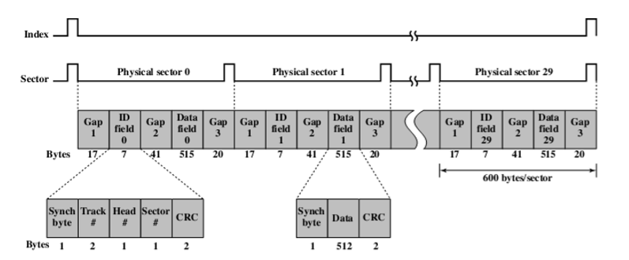

1. Gap1是缓冲，防止过去。
2. ID field:8位同步字节:Synch byte，不记录信息，提示将要达到新的扇区。
    + Synch byte:提示即将到达新的数据区域。特殊字节
    + Track：扇区号
    + Head
    + Sector
    + CRC:循环冗余检验
    + ...
4. Gap2:缓冲用来判断这个ID信息是否是我们想写的部分
5. Data field:数据区
6. 快速格式化:没有修改数据，而是直接修改数据区为可用。(只要修改ID field即可)

### 1.1.4. 读写数据需要的时间

1. 寻道时间(seek time):比较复杂，一般题目会直接告知。 the time required to move the disk arm to the required track(将磁盘臂移动到所需磁道所需的时间)
    + Initial startup time(初始启动时间)
    + Time taken to traverse the tracks(穿越轨道需要的时间)
2. 旋转延时(Rotational delay): The time it takes for the beginning of the sector to reach the head(从一个扇区到遇到目标区域的旋转需要的时间)
    + 我们一般认为是半圈旋转需要的时间。
3. 读取数据时间(Data transfer):
    + 一般是和旋转的盘的时间:转过一个扇区的时间

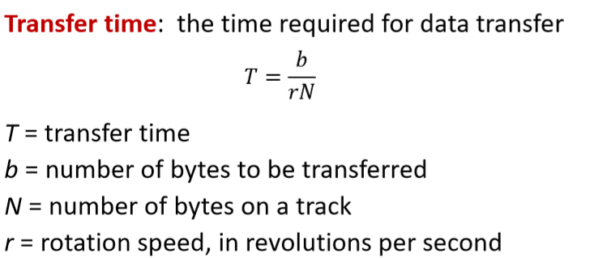

4. 访问时间(Access time): seek time + rotational delay(不用管)

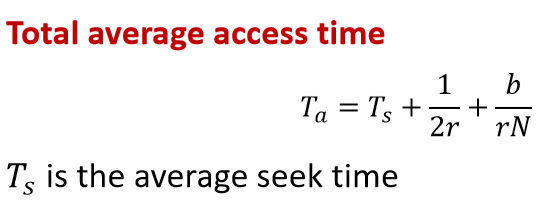

5. 一个磁道到紧邻的一个磁道，需要寻道时间吗？需要旋转延时吗？
    + 需要的是**旋转延时**，读写时候的旋转的速度是不同的，而紧邻的磁道的**寻道时间可以忽略**。
    + 写的时候转的慢、读的时候转得快就需要再等一周来写入。
6. Eg.
    + Consider a disk with an advertised average seek time of 4 ms, rotation speed of 15,000 rpm(转/分), and 512-byte sectors(默认) with 500 sectors per track. 我们考虑一个平均寻道时间4ms的磁盘，旋转速度为15,000rpm,一个磁道512B,一圈有500个磁道
    + Suppose that we wish to read a file consisting of 2500 sectors for a total of 1.28 Mbytes 假设我们希望读取由2500个磁道组成的1.28Mb的数据
    + Condition 1: sequential organization The file occupies all of the sectors on 5 adjacent tracks (5 tracks × 500 sectors/track 2500 sectors) 顺序组织文件占据5个相邻磁道上的所有扇区
        + 4 + (4/2 + 4) * 5 ms = 0.034s
        + 旋转延时每一个磁道有一个
    + Condition 2: random access The sectors are distributed randomly over the disk 随机存取扇区随机分布在磁盘上
        + (4 + 4/2 + 4/500)* 2500 ms = 15.02s
7. 上面两个问题的差别:在寻道时间+旋转延时上
8. Eg.
    + 如果在一个磁道中已经使用到了一些数据，占据了6个相邻的磁道
    + 4 + 4/2 * 6 + 4/500 * 2500(不可改变的是数据读取时间)
9. 磁盘整理:就是在使用的时候磁盘会被**碎片化**
    + 此时会出现空隙，导致一些文件变成了小块。
    + 过多的磁盘整理，会导致高强度的读写，容易造成磁盘损坏。

## 1.2. 磁头寻道策略
1. First come first service (FCFS)(先到先服务)
    + Process I/O in sequence(按顺序处理I/O例程)
    + 磁头随机跑:效率低，但是每一个进来的任务都会被及时处理。
2. Shortest seek time first (SSTF)(最少的查找时间)
    + Move the head to the nearest track required by an I/O(移动到I/O提供的最近的区域处理)
    + 寻找的一个最优解:找到一个最近的来进行处理。有一些任务可能会被遗漏到很晚。
3. SCAN
    + Move the head between track 0 and track N(在磁道0和磁道N之间移动)
    + 在不同磁道之间跑来进行处理，所以平均下来速度是一定的。往返跑
    + 最长的等待时间是一定的，(宽度一定)
4. C-SCAN
    + Move the head from track N to track 0(将磁头从磁道N跳回磁道0)
    + 就是SCAN来的反向，从N跳到0，然后慢慢回来
5. LOOK
    + Like SCAN but track 0 and track N are not required
    + **处理完之后如果发现没有任务了就掉头**，扫描距离不同。

# 2. Optical Disk(光盘)
1.  Optical disk products
    1. CD: Compact Disk
    2. CD-ROM: Compact Disk Read-Only Memory
    3. CD-R: CD Recordable
    4. CD-RW: CD Rewritable
    5. DVD: Digital Versatile Disk
    6. DVD-R: DVD Recordable
    7. DVD-RW: DVD Rewritable
    8. Blu-Ray DVD: High definition video disk

## 2.1. CD and CD-ROM
1. Production(制作过程)
    + Create a master disk with a finely focused, high-intensity laser(用精细聚焦的**高强度激光**制作**主盘**)
    + Make a die to stamp out copies onto polycarbonate by using the master(制作一个模子，用**母版把复制品印在聚碳酸酯上**)
    + Coat the pitted surface with a highly reflective surface(在有凹痕的表面涂上一层高反射面)
    + Protect the shiny surface by a top coat of clear acrylic(用透明丙烯酸面漆保护光亮的表面)
    + A label can be silkscreened onto the acrylic(标签可以用丝网印在丙烯酸树脂上)

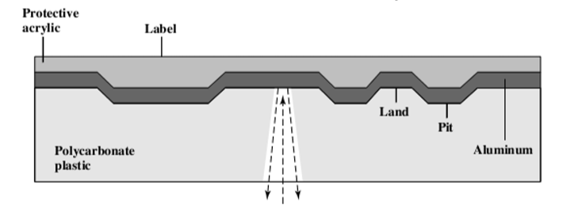

2. 中间一面是凹凸不平的，镀一层金属:镀上一层铝或者金。
3. 首先做一张母盘，然后做模板，然后批量做光盘

### 2.1.1. 读写
1. Read(光盘读出)
    + retrieved from a CD or CD-ROM by a low-powered laser housed in an optical-disk player, or drive unit(由装在光盘播放器或驱动器中的低功率激光器从CD或CD-ROM中取出 )
        + If the laser beam falls on a pit, which has a somewhat rough surface, the light scatters and a low intensity is reflected back(如果激光束落在凹坑上，凹坑表面有点粗糙，则光会散射并反射回低强度)
        + If the laser beam falls on a land, which is a smooth surface, a higher intensity is reflected back(如果激光束落在光滑的地面上，会反射出更高的强度)
    + The disk contains a single spiral track, and all sectors are the same length(磁盘包含一个螺旋轨道，所有扇区的长度都相同)
        + Rotating the disk at a variable speed(以变速旋转磁盘)
        + The pits are then read by the laser at a constant linear velocity(然后用激光以**恒定的线速度**读取凹坑)
2. 光盘的磁道是一个螺旋线，靠激光回来的反射。
3. 通过比较强的光来改变中间层的反射特性来产生两种不同的反射特性以表示信息

### 2.1.2. 区别以及优缺点
1. Difference of CD and CD-ROM(CD和CD-ROM之间的不同)
    + CD-ROM players are more rugged and have error correction devices to ensure that data are properly transferred(CD-ROM播放器更稳定，并有纠错装置，以确保数据正确传输)
2. Advantage(优点)
    + The optical disk together with the information stored on it can be mass replicated inexpensively(光盘及其上存储的信息可以廉价地大量复制)
    + The optical disk is removable(光盘是可以移动的)
3. Disadvantage(缺点)
    + It is read-only and cannot be updated(光盘是只读的，并且不可以被更新)
    + It has an access time much longer than that of a magnetic disk drive(它的访问时间比磁盘驱动器长得多)

## 2.2. CD-R and CD-RW
1. CD-R(CD-R)
    + Include a dye layer, which is used to change reflectivity and is activated by a high-intensity laser(包括染料层，用于改变反射率并由高强度激光激活)
    + The resulting disk can be read on a CD-R or CD-ROM drive(生成的磁盘可以在CD-R或CD-ROM驱动器上读取)
2. CD-RW
    + Uses a material that has two different reflectivities in two different phase states, which can be changed by laser light(使用一种在两种不同的相位状态下具有两种不同反射率的材料，这种反射率可以通过激光改变)
    + The material eventually and permanently loses its desirable properties, usually between 500,000 and 1,000,000 erase cycles(这种材料最终和永久地失去了它所需要的性能，通常在500,000到1,000,000个擦除周期之间)

## 2.3. DVD
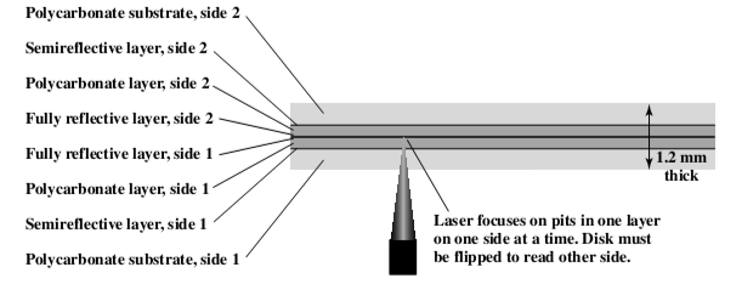

1. Compared to CD(和CD相比)
    + Bits are packed more closely on a DVD(在DVD中，每一位被存储的更加紧密)
    + The DVD employs a second layer of pits and lands on top of the first layer(DVD采用了第二层凹坑，并在第一层上面着陆)
    + The DVD-ROM can be two sided, whereas data are recorded on only one side of a CD(DVD-ROM可以是双面的，而数据只能记录在CD的一侧)
2. 特点:
    1. 光束比较细，密度比较高，扩充容量
    2. 一侧过去有两个放射层

## 2.4. High-Definition Optical Disk
1. 蓝光:波长更短
2. Provide higher bit density by using a laser with a shorter wavelength, in the blue-violet range(使用在蓝光区域的更短波长的光来提供更高的数据密度)
3. The data pits are smaller(数据池比较小)

# 3. 磁带(Magnetic Tape)
1. Use the same reading and recording techniques as magnetic disk(使用和磁盘相同的读写设备)
2. The medium is flexible polyester tape coated with magnetizable material(该介质是可磁化材料涂覆的柔性聚酯带。)
3. Parallel recording vs. serial recording (serpentine recording)(并行记录与串行记录（蛇形记录）)

4. 用于大音频数据的存储
5. 多个磁头并行写很简单
6. 一个磁头怎么写?就是1->5->9横向的