CPU Structure and Function
---
<!-- TOC -->

- [1. Task of CPU](#1-task-of-cpu)
- [2. CPU Requirement(CPU的需要)](#2-cpu-requirementcpu的需要)
- [3. Register Organization](#3-register-organization)
    - [3.1. User-visible Register(用户可见寄存器)](#31-user-visible-register用户可见寄存器)
        - [3.1.1. General purpose register(通用寄存器)](#311-general-purpose-register通用寄存器)
        - [3.1.2. Data register(数据寄存器)](#312-data-register数据寄存器)
        - [3.1.3. Address register(地址寄存器)](#313-address-register地址寄存器)
        - [3.1.4. Design issues(设计问题)](#314-design-issues设计问题)
        - [3.1.5. Condition codes register(条件码寄存器)](#315-condition-codes-register条件码寄存器)
        - [3.1.6. Store and recovery(存储和恢复)](#316-store-and-recovery存储和恢复)
    - [3.2. Control and Status Register 控制和状态寄存器](#32-control-and-status-register-控制和状态寄存器)
        - [3.2.1. Program counter (PC)](#321-program-counter-pc)
        - [3.2.2. Instruction register (IR)](#322-instruction-register-ir)
        - [3.2.3. Memory address register (MAR)](#323-memory-address-register-mar)
        - [3.2.4. Memory buffer register (MBR)内存缓存寄存区](#324-memory-buffer-register-mbr内存缓存寄存区)
        - [3.2.5. Program status word (PSW):程序状态字](#325-program-status-word-psw程序状态字)
        - [3.2.6. Other registers related to status and control(与状态和控制有关的其他寄存器)](#326-other-registers-related-to-status-and-control与状态和控制有关的其他寄存器)
        - [3.2.7. Design issues(设计问题)](#327-design-issues设计问题)
- [4. Indirect Cycle(间址周期)](#4-indirect-cycle间址周期)
- [5. Data Flow(数据流转)](#5-data-flow数据流转)
- [6. Instruction Pipelining(指令流水线)](#6-instruction-pipelining指令流水线)
    - [6.1. Two Stages Solution(两种存储策略)](#61-two-stages-solution两种存储策略)
- [7. Six Stages Solution(6级流水线)](#7-six-stages-solution6级流水线)
    - [7.1. Pipeline Performance(加速比)](#71-pipeline-performance加速比)
        - [7.1.1. Misunderstanding(误解)](#711-misunderstanding误解)
        - [7.1.2. Reason 原因](#712-reason-原因)
- [8. Hazard(冒险)](#8-hazard冒险)
    - [8.1. Structure Hazard(结构冒险)](#81-structure-hazard结构冒险)
        - [8.1.1. Reason](#811-reason)
        - [8.1.2. Solution](#812-solution)
    - [8.2. Data Hazard(数据冒险)](#82-data-hazard数据冒险)
        - [8.2.1. Reason(原因)](#821-reason原因)
        - [8.2.2. Solution](#822-solution)
    - [8.3. Control Hazard(控制冒险)](#83-control-hazard控制冒险)
        - [8.3.1. Reason](#831-reason)
        - [8.3.2. Solution](#832-solution)

<!-- /TOC -->

# 1. Task of CPU
1. Fetch instruction: The processor reads an instruction from memory (register, cache, main memory)(获取指令：处理器从内存（寄存器、缓存、主存）读取指令)
2. Interpret instruction: The instruction is decoded to determine what action is required(解释指令：对指令进行解码以确定所需的操作)
3. Fetch data: The execution of an instruction may require reading data from memory or an I/O module(获取数据：指令的执行可能需要从内存或I/O模块读取数据)
4. Process data: The execution of an instruction may require performing some arithmetic or logical operation on data(处理数据：指令的执行可能需要对数据执行一些算术或逻辑运算)
5. Write data: The results of an execution may require writing data to memory or an I/O module(写入数据：执行的结果可能需要将数据写入内存或I/O模块)

# 2. CPU Requirement(CPU的需要)
1. The processor needs to store some data temporarily(处理器需要临时存储一些数据)
2. It must remember the location of the last instruction so that it can know where to get the next instruction(它必须记住最后一条指令的位置，以便知道下一条指令的位置)
3. It needs to store instructions and data temporarily while an instruction is being executed(It needs to store instructions and data temporarily while an instruction is being executed)(指令执行时需要临时存储指令和数据（指令执行时需要临时存储指令和数据）)
4. The processor needs a small internal memory(处理器需要一个小的内存)

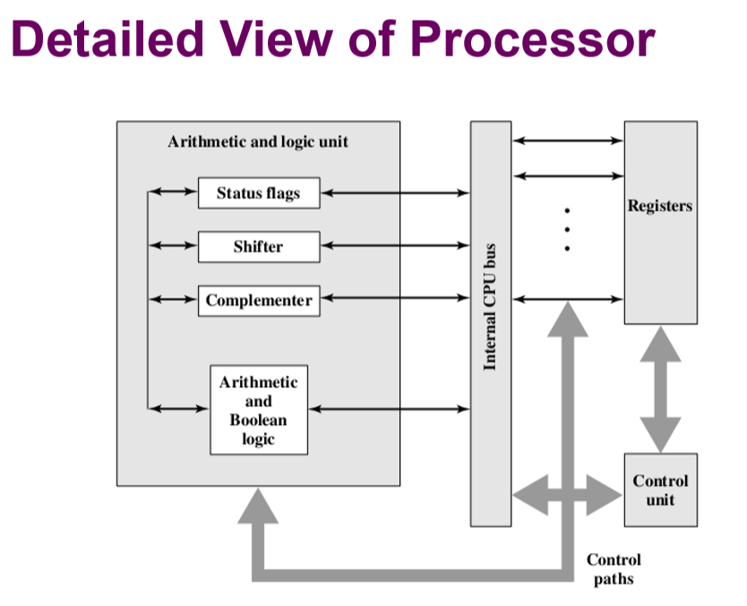

# 3. Register Organization
1. The registers in the processor perform two roles:(处理器中的寄存器执行两个角色：)
    1. User-visible registers(用户可见寄存器): Enable the machine- or assembly language programmer to minimize main memory references by optimizing use of registers(用户可见寄存器：通过优化寄存器的使用，使机器或汇编语言程序员能够最小化主内存引用)
    2. Control and status registers(控制和状态寄存器): Used by the control unit to control the operation of the processor and by privileged, operating system programs to control the execution of programs(控制和状态寄存器：由控制单元用来控制处理器的操作，由特权操作系统程序用来控制程序的执行,控制和状态寄存器对于用户是不开放的)

## 3.1. User-visible Register(用户可见寄存器)

### 3.1.1. General purpose register(通用寄存器)
1. Assigned to a variety of functions by programmer(由程序员分配给各种功能)

### 3.1.2. Data register(数据寄存器)
1. Used only to hold data and cannot be employed in the calculation of an operand address(仅用于保存数据，不能用于计算操作数地址)

### 3.1.3. Address register(地址寄存器)
1. General purpose or devoted to a particular addressing mode(通用的或专用于特定寻址方式的)
2. E.g.: segment pointer, index register, stack register, …(例如：段指针、索引寄存器、堆栈寄存器，)

### 3.1.4. Design issues(设计问题)
1. Whether to use completely general-purpose registers or to specialize their use(是完全使用通用寄存器还是专门使用它们)
2. Number of registers(寄存器数量)
    + Fewer registers result in more memory references(更少的寄存器导致更多的内存引用)
    + More registers do not noticeably reduce memory references(更多的寄存器不会明显减少内存引用)
    + 均衡最好
3. Register length(寄存器长度)
    + Must be at least long enough to hold the largest address or values of most data types(必须至少足够长以容纳大多数数据类型的最大地址阈值)
    + Some machines allow two contiguous registers to be used as one for holding double-length values(有些机器允许使用两个相邻的寄存器作为一个寄存器来保存双长度值)

### 3.1.5. Condition codes register(条件码寄存器)
1. Condition codes are bits set by the processor hardware as the result of operations(条件码是处理器硬件根据操作结果设置的位)
2. At least partially visible to the user(用户至少部分可见)

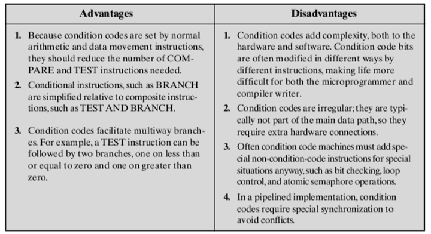

### 3.1.6. Store and recovery(存储和恢复)
1. A subroutine call will result in the automatic saving of all user-visible registers, to be restored on return(子例程调用将**自动保存所有用户可见**的寄存器，并在返回时还原)
    + The processor performs the saving and restoring as part of the execution of call and return instructions(处理器执行保存和恢复，作为执行调用和返回指令的一部分)
    + This allows each subroutine to use the user-visible registers independently(这允许每个子程序独立使用用户可见寄存器)
2. The programmer should save the contents of the relevant user-visible registers prior to a subroutine call, by including instructions for this purpose in the program(在调用子程序之前，程序员应该保存相关的用户可见寄存器的内容，方法是在程序中包含用于此目的的指令)

## 3.2. Control and Status Register 控制和状态寄存器
1. Employed to control the operation of the processor(用于控制处理器的操作)
2. Most of these, on most machines, are not visible to user(在大多数机器上，这些大部分对用户是不可见的)
    + Some of them may be visible to machine instructions executed in a control or operating system mode(其中一些对在控制或操作系统模式下执行的机器指令是可见的)

### 3.2.1. Program counter (PC)
1. Contains the address of an instruction to be fetched(包含要获取的指令的地址)
2. Typically, the processor updates the PC after each instruction fetch so that the PC always points to the next instruction to be executed(通常，处理器在每次取指令后更新PC，以便PC始终指向要执行的下一条指令)
3. A branch or skip instruction will also modify the contents of the PC(分支或跳过指令也会修改PC的内容)
4. 取指之后就会更新，一旦取指完成，PC就已经完成更新

### 3.2.2. Instruction register (IR)
1. Contains the instruction most recently fetched(包含最近获取的指令)
2. The fetched instruction is loaded into an IR, where the opcode and operand specifiers are analyzed(获取的指令被加载到IR中，在IR中分析操作码和操作数说明符)

### 3.2.3. Memory address register (MAR)
1. Contains the address of a location in memory(包含内存中某个位置的地址)
2. MAR connects directly to the address bus(MAR直接连接到地址总线)
3. **不仅仅是存储指令的地址，而是可以存储所有的数据地址。**

### 3.2.4. Memory buffer register (MBR)内存缓存寄存区
1. Contains a word of data to be written to memory or the word most recently read(包含要写入内存的数据字或最近读取的数据字)
2. MBR connects directly to the data bus, and user-visible registers, in turn, exchange data with the MBR(MBR直接连接到数据总线，用户可见的寄存器反过来与MBR交换数据)
3. ALU may have direct access to the MBR and uservisible registers(ALU可以直接访问MBR和用户可见寄存器)

### 3.2.5. Program status word (PSW):程序状态字
1. A register or set of registers contain status information(一个或一组寄存器包含状态信息)
2. Sign: Sign bit of the result of the last arithmetic operation(Sign：最后一次算术运算结果的符号位)
3. Zero: Set when the result is 0.(0：结果为0时设置。)
4. Carry: Set if an operation resulted in a carry (addition) into or borrow (sub-traction) out of a high-order bit(进位：如果一个操作导致高阶钻头进位（增加）或出位（副牵引），则设置)
5. Equal: Set if a logical compare result is equality(相等：设置逻辑比较结果是否相等)
6. Overflow: Indicate arithmetic overflow(溢出：表示算术溢出)
7. Interrupt enable/disable: Enable or disable interrupts(中断启用/禁用：启用或禁用中断)
8. Supervisor: Indicates whether the processor is executing in supervisor or user mode(Supervisor：指示处理器是以Supervisor模式还是用户模式执行，操作系统模式)

### 3.2.6. Other registers related to status and control(与状态和控制有关的其他寄存器)
1. A pointer to a block of memory containing additional status information(指向包含附加状态信息的内存块的指针)
2. In machines using vectored interrupts, an interrupt vector register may be provided(在使用矢量中断的机器中，可以提供中断矢量寄存器)
3. If a stack is used to implement certain functions, a system stack pointer is needed(如果使用堆栈来实现某些函数，则需要系统堆栈指针)
4. A page table pointer is used with a virtual memory system(页表指针用于虚拟内存系统)

### 3.2.7. Design issues(设计问题)
1. Operating system support(操作系统支持)
    1. Certain types of control information are of specific utility to the operating system(某些类型的控制信息对操作系统具有特定的实用性)
    2. If the processor designer has a functional understanding of the operating system to be used, register organization can to some extent be tailored to the operating system(如果处理器设计者对要使用的操作系统有一个功能上的理解，那么注册组织在某种程度上可以根据操作系统进行定制)
2. Allocation of control information between registers and memory (主存和寄存器之间的控制信息的交换)
    1. It is common to dedicate the first (lowest) few hundred or thousand words of memory for control purposes(为了控制的目的，通常将第一个（最低的）几百或几千字的内存专用于控制目的)
    2. Trade-off of cost versus speed arises(成本与速度的权衡)

# 4. Indirect Cycle(间址周期)
1. The execution of an instruction may involve one or more operands in memory, each of which requires a memory access(指令的执行可能涉及内存中的一个或多个操作数，每个操作数都需要内存访问)
2. If indirect addressing is used, additional memory accesses are required(如果使用间接寻址，则需要额外的内存访问)
3. Treat the fetching of indirect addresses as one more instruction stages(将间接地址的获取视为一个或多个指令阶段)

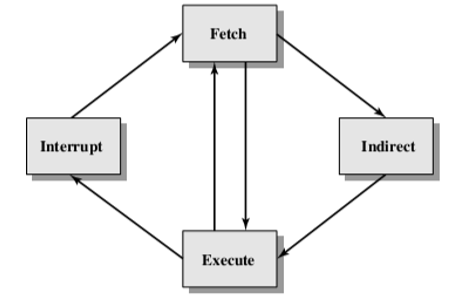
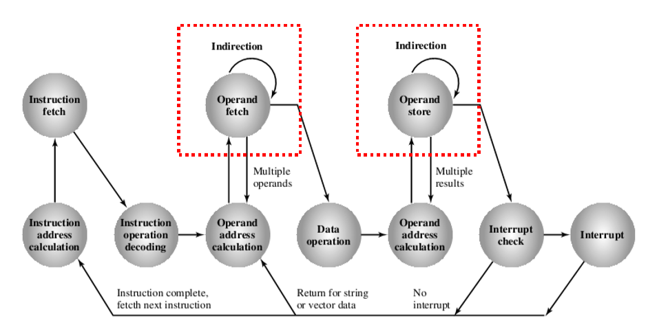

# 5. Data Flow(数据流转)
1. Assume a processor that employs a memory address register (MAR), a memory buffer register (MBR), a program counter (PC), and an instruction register (IR)(假设处理器使用内存地址寄存器（MAR）、内存缓冲寄存器（MBR）、程序计数器（PC）和指令寄存器（IR）)
2. Fetch cycle
    + 把下一条指令地址放到MAR中去，然后交给memory
    + 控制单元设置控制线的信号，如果控制线设置为相应信号，内存会始终监听信号线，当它从上面那根短线读到读信号，则从MAR中读出一个地址，然后取出数据给数据总线。
    + 将数据从**数据总线**读取到MBR中，然后拷贝到IR中去。

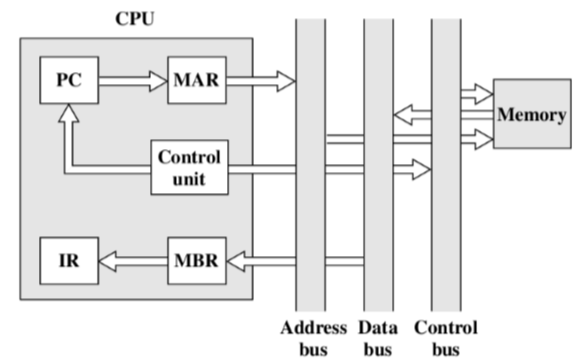

3. Indirect cycle(间址周期)
    + MBR中是地址，把地址拷贝到MAR中
    + 控制单元发送读请求，内存从MAR中进行拉取后，从内存中取出来，返给MBR。
    + **间址操作是指在间址周期中的和正常周期多出来的操作。**

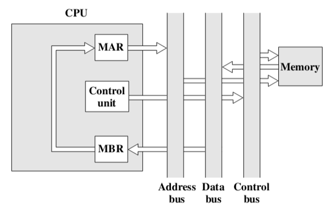

4. Interrupt cycle(中断，需要调用)
    + 控制单元会先告诉主存有写操作
    + 之后控制单元会为MAR指定一个写入的位置。

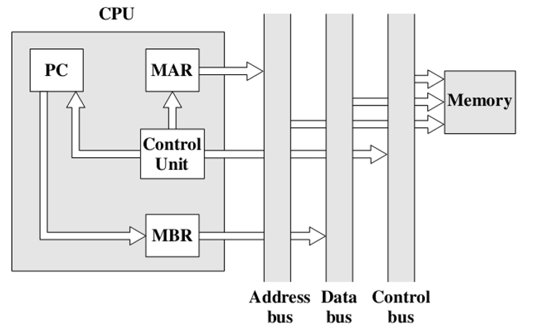

# 6. Instruction Pipelining(指令流水线)
1. Pipelining(流水线)
    + If a product goes through various stages of production, products at various stages can be worked on simultaneously by laying the production process out in an assembly line(如果一个产品经历了不同的生产阶段，那么可以通过在装配线上布置生产过程来同时处理不同阶段的产品)
2. In fact, an instruction has a number of stages(实际上，指令有许多阶段)

## 6.1. Two Stages Solution(两种存储策略)
1. Subdivide instruction processing into two stages: fetch instruction and execute instruction(将指令处理细分为两个阶段：获取指令和执行指令)
2. Fetch the next instruction in parallel with the execution of the current one(在执行当前指令的同时获取下一条指令)
3. Problem: memory access conflict(**问题**：内存访问冲突)


4. There are times during the execution of an instruction when main memory is not being accessed(在指令执行过程中，有时不访问主存)
5. More problems
    1. Execution time will generally be longer than fetch time(执行时间通常比获取时间长)
    2. A conditional branch instruction makes the address of the next instruction to be fetched unknown(条件分支指令使要获取的下一条指令的地址未知)

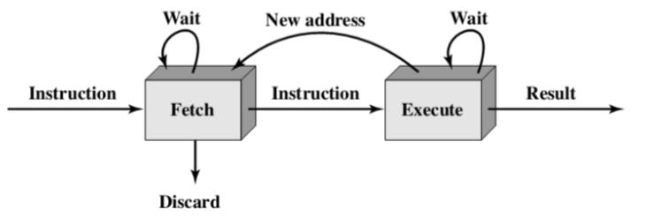

# 7. Six Stages Solution(6级流水线)
>几级流水线表示分为了几个微操作。
1. To gain further speedup, the pipeline must have more stages(为了进一步加速，管道必须有更多的阶段)
    1. Fetch instruction (FI): Read the next expected instruction into a buffer(获取指令（FI）：将下一条预期指令读入缓冲区)
    2. Decode instruction (DI):Determine opcode and operand specifiers(Decode instruction (DI):Determine opcode and operand specifiers)（解码指令（DI）：确定操作码和操作数说明符（解码指令（DI）：确定操作码和操作数说明符）
    3. Calculate operands (CO): Calculate effective address of each source operand(计算操作数CO：计算每个源操作数的有效地址)
    4. Fetch operands (FO): Fetch each operand from memory. Operands in registers need not be fetched(获取操作数（FO）：从内存中获取每个操作数。不需要获取寄存器中的操作数)
    5. Execute instruction (EI): Perform the indicated operation and store the result, if any, in the specified destination operand location(执行指令（EI）：执行指定的操作并将结果（如果有的话）存储在指定的目标操作数位置)
    6. Write operand (WO):Store the result in memory(写入操作数（WO）：将结果存储在内存中)
2. The various stages will be of more nearly equal duration(各个阶段的持续时间将更接近相等)
3. Example: reduce the execution time for 9 instructions from 54 time units to 14 time units(示例：将9条指令的执行时间从54个时间单位减少到14个时间单位)

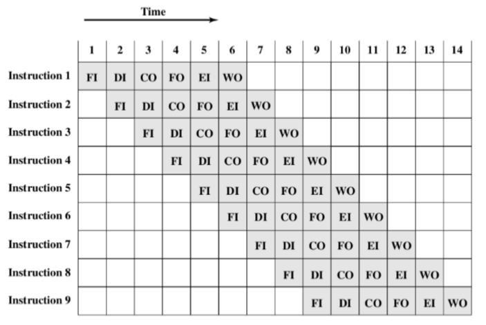

4. 问题：
    1. 最多的时候会同时处理6件事情，所以需要遵守6个任务中时间最长的任务所需时间。
    2. 因为微指令之间存在时间间隔，所以6个指令加起来的运算时间要大于原来一次计算完
    3. 不是所有的指令都有6个结点，比如加载指令不需要WO阶段。
    4. 可能出现内存冲突的问题

4. Comment 评价
    1. Not all the instructions contain six stages(不是所有的指令都有6个部分)
        1. E.g.: Load instruction does not need the WO stage(加载指令不用WO指令)
        2. To simplify hardware, the timing is set up assuming that each instruction requires all six stages(为了简化硬件，设置时间的前提是每条指令都需要所有六个阶段)
    2. Not all the stages can be performed in parallel(不是所有的阶段都可以并行执行)
        1. E.g.: FI, FO, and WO stages involve a memory access(FI、FO和WO阶段涉及内存访问)
        2. The desired value may be in cache, or the FO or WO stage may be null(期望值可能在缓存中，或者FO或WO stage可能为空)

5. Limitation 限制
    1. If the six stages are not of equal duration, there will be some waiting involved at various pipeline stages(如果这六个阶段的持续时间不相等，那么在不同的管道阶段会有一些等待)
    2. Conditional branch instruction can invalidate several instruction fetches(条件分支指令可以使多个指令获取无效)

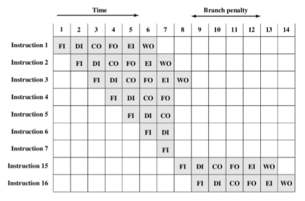

6. Interrupt
    + 上面如果调到了15号指令，则之前的所有的数据都被“浪费掉”

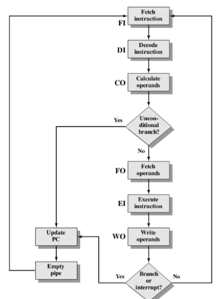

7. Another viewpoint
    + 从竖向的方式来看

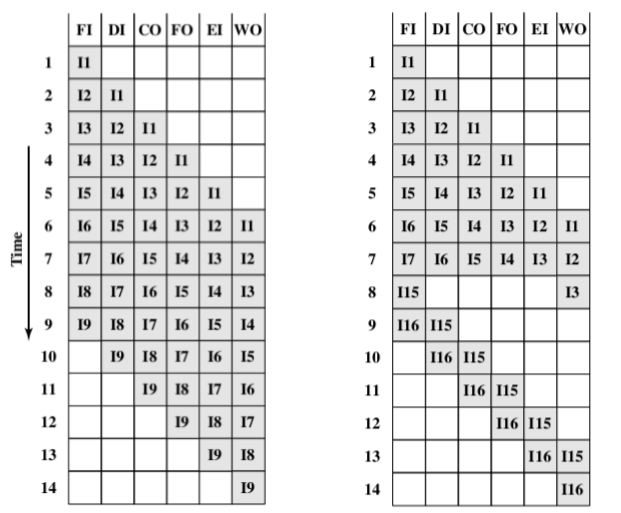

## 7.1. Pipeline Performance(加速比)
1. Assume
    1. 𝑡𝑖: time delay of the circuitry in the ith stage of pipeline(k级流水线执行n条指令所需的总时间第i级流水线电路的延时)
    2. 𝑡𝑚: maximum stage delay(最大级延迟)
    3. 𝑘: number of stages in the instruction pipeline(指令管道中的阶段数)
    4. 𝑑: time delay of a latch, needed to advance signals and data from one stage to the next(锁存器的时间延迟，用于将信号和数据从一个阶段提前到下一个阶段)
2. Cycle time：𝑡 = max[𝑡<sub>𝑖</sub>] + 𝑑 = 𝑡<sub>𝑚</sub> + 𝑑
3. 加速比是指使用了流水线后加速的比例
4. Total time required for a pipeline with  k stages to execute n instructions(具有k个阶段的管道执行n条指令所需的总时间)
5. Speedup factor(加速比)
    + **加速比>1**
    + 分子:未使用流水线
    + 分母:使用流水线
    + 考法:一般在发生指令跳转的情况下来计算，在之前的例子中实际运行了5条指令

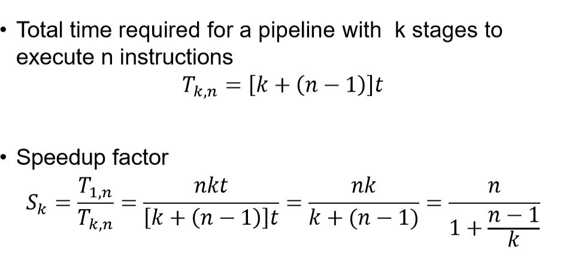

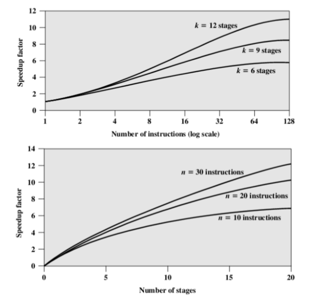

### 7.1.1. Misunderstanding(误解)
1. 流水线不是分隔的越细越好
    1. 会造成指令间隔变多,间隔浪费的时间也会增加
    2. 会造成指令控制变得复杂

### 7.1.2. Reason 原因
1. At each stage of the pipeline, there is some overhead involved in moving data from buffer to buffer and in performing various preparation and delivery functions(在管道的每个阶段，将数据从一个缓冲区移动到另一个缓冲区以及执行各种准备和传递功能都会涉及一些开销)
2. The amount of control logic required to handle memory and register dependencies and to optimize the use of pipeline increases enormously with the number of stages(处理内存和寄存器依赖项以及优化管道使用所需的控制逻辑量随着阶段数的增加而大大增加)

# 8. Hazard(冒险)
1. In some cases, instruction pipeline will be blocked or stalled the subsequent instructions cannot be correctly executed(在某些情况下，指令管道将被阻塞或暂停后续指令无法正确执行)
2. Type
    1. Structure hazard / hardware resource conflict(结构冒险/硬件资源冲突)
    2. Data hazard / data dependency(数据冒险/数据依赖)
    3. Control hazard(控制冒险)

## 8.1. Structure Hazard(结构冒险)

### 8.1.1. Reason
1.  The same device is accessed by different instructions(相同的硬件被不同的操作访问)

### 8.1.2. Solution
1. A device can be accessed once in one instruction, and use multiple different devices(一个设备可以在一条指令中访问一次，并使用多个不同的设备)
2. 可以分时复用，前半段读出，后半段写入。


## 8.2. Data Hazard(数据冒险)

### 8.2.1. Reason(原因)
1. The data required by a instruction is not generated(指令需要的数据不是被生成的)

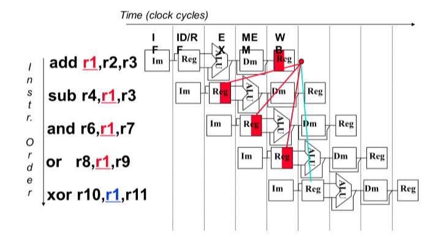

### 8.2.2. Solution
1. Insert nop instruction(插入nop指令)

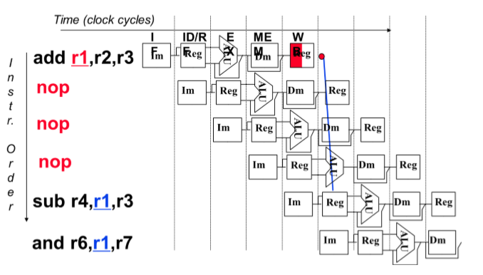

2. Insert bubble(插入等待)

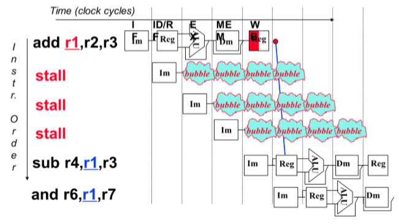

3. Forwarding / bypassing(转发/绕过)
    + 添加一根线来拿到目标数据(旁路)

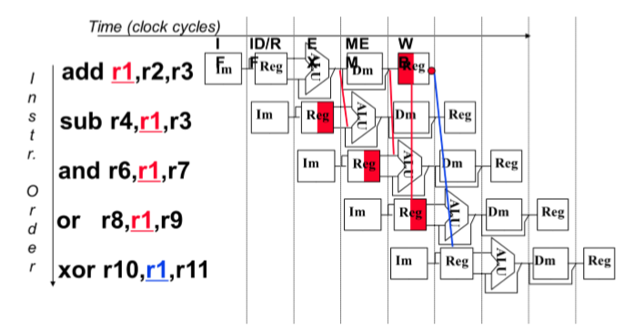

4. Exchange instruction orders(改变指令顺序)
    + 比如load指令:只能在第四小周期才能拿到。

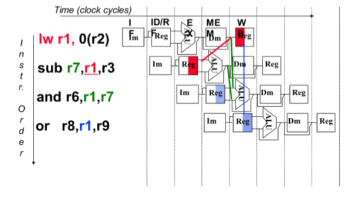

5. 调整指令的处理顺序可以进一步优化操作
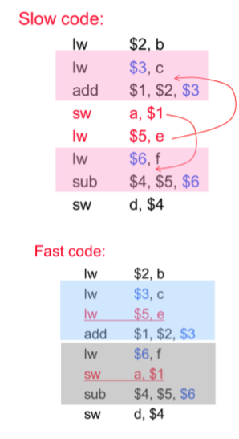

## 8.3. Control Hazard(控制冒险)

### 8.3.1. Reason
1. The order of instruction execution is changed(指令执行顺序改变)
2. Transfer: branch, loop, …(转移:分支、循环)
3. Interrupt(中断)
4. Exception(异常)
5. Call / return(调用/返回)

### 8.3.2. Solution
1. Multiple streams:  replicate the initial portions of the pipeline and allow the pipeline to fetch both instructions, making use of two streams(多个流：复制管道的初始部分，并允许管道使用两个流来获取两条指令)
2. Prefetch branch target: When a conditional branch is recognized, the target of the branch is prefetched, in addition to the instruction following the branch(预取分支目标：当一个条件分支被识别时，除了分支后面的指令外，分支的目标也被预取)
3. Loop buffer: use a small, very-high-speed memory maintained by the instruction fetch stage of the pipeline and containing the n most recently fetched instructions, in sequence(循环缓冲区：使用一个由管道的指令获取阶段维护的小的、非常高速的内存，该内存按顺序包含n个最近获取的指令)
4. Delayed branch: exchange instruction orders(延迟分行：换货指示单)
5. Branch prediction(分支预测)
    1. Predict never taken(从不做分支预测)
    2. Predict always taken(一直做分支预测)
    3. Predict by opcode(根据操作码进行分支预测)

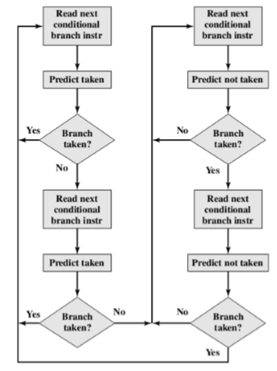

6. Branch prediction
    1. Taken/not taken switch(是否进行转换)
    2. Branch history table(分支历史表) 分支历史表(循环)是一个分支(循环一个)
```java
i = 1;
while(i < n){
    i++;
}
//分支预测n+1次
```

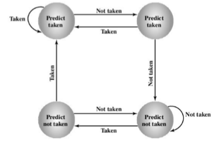
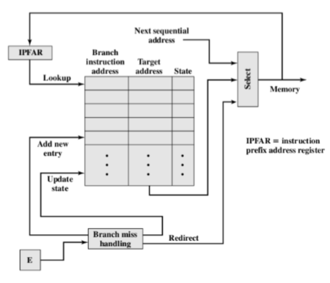


