Input / Output
---
<!-- TOC -->

- [1. Peripheral Device(外部设备，外设)](#1-peripheral-device外部设备外设)
- [2. Why NOT Connect I/O Device To Bus 为什么不直接把I/O模块连接到总线](#2-why-not-connect-io-device-to-bus-为什么不直接把io模块连接到总线)
- [3. I/O Module I/O模块](#3-io-module-io模块)
    - [3.1. Interface to Peripheral 到外部设备的接口](#31-interface-to-peripheral-到外部设备的接口)
    - [3.2. I/O Module Functions I/O模块的作用](#32-io-module-functions-io模块的作用)
        - [3.2.1. Processor communication 处理器交互](#321-processor-communication-处理器交互)
        - [3.2.2. Device communication 设备交互](#322-device-communication-设备交互)
        - [3.2.3. Control and timing 控制和定时](#323-control-and-timing-控制和定时)
        - [3.2.4. Data buffering 数据缓冲](#324-data-buffering-数据缓冲)
        - [3.2.5. Error detection 错误探测](#325-error-detection-错误探测)
- [4. I/O Module Structure](#4-io-module-structure)
    - [4.1. External Interface 外部接口](#41-external-interface-外部接口)
        - [4.1.1. 并行接口 Parallel interface:](#411-并行接口-parallel-interface)
        - [4.1.2. 串行接口 Serial interface:](#412-串行接口-serial-interface)
- [5. I/O Operation Technique I/O 操作技术](#5-io-operation-technique-io-操作技术)
    - [5.1. Programmed I/O 编程式 I/O](#51-programmed-io-编程式-io)
        - [5.1.1. I/O Command I/O命令](#511-io-command-io命令)
        - [5.1.2. I/O Instruction I/O指令](#512-io-instruction-io指令)
    - [5.2. Interrupt Driven I/O 中断驱动式的I/O](#52-interrupt-driven-io-中断驱动式的io)
        - [5.2.1. View point of I/O module 从I/O模块看](#521-view-point-of-io-module-从io模块看)
        - [5.2.2. View point of processor 从处理器角度](#522-view-point-of-processor-从处理器角度)
        - [5.2.3. Device Identification 设备确认](#523-device-identification-设备确认)
        - [5.2.4. Assigning Priority 优先级问题](#524-assigning-priority-优先级问题)
        - [5.2.5. Interrupts Enabled and Disabled(开关中断)](#525-interrupts-enabled-and-disabled开关中断)
        - [5.2.6. Response Priority and Processing Priority 响应优先级以及处理优先级](#526-response-priority-and-processing-priority-响应优先级以及处理优先级)
- [6. Direct Memory Access 直接内存访问](#6-direct-memory-access-直接内存访问)
    - [6.1. problem DMA存在的问题](#61-problem-dma存在的问题)
    - [6.2. DMA](#62-dma)
    - [6.3. Memory Access 内存权限](#63-memory-access-内存权限)
        - [6.3.1. Stop CPU 停止CPU](#631-stop-cpu-停止cpu)
        - [6.3.2. Cycle stealing 周期窃取](#632-cycle-stealing-周期窃取)
        - [6.3.3. Alternate (time sharing) access 共享权限](#633-alternate-time-sharing-access-共享权限)
    - [6.4. Connection 连接](#64-connection-连接)
        - [6.4.1. DMA mechanism configuration DMA机制配置](#641-dma-mechanism-configuration-dma机制配置)
    - [6.5. Hard Disk Access](#65-hard-disk-access)
- [7. Evolutionary of I/O Module I/O 模块的发展进程](#7-evolutionary-of-io-module-io-模块的发展进程)

<!-- /TOC -->

# 1. Peripheral Device(外部设备，外设)
1. I/O operations are accomplished through a wide assortment of external devices that provide a means of exchanging data between the external environment and the computer(I/O操作是通过各种各样的外部设备来完成的，这些外部设备提供了一种在外部环境和计算机之间交换数据的方法)
2. An external device connected to an I/O module is often referred to as a peripheral device or, simply, a peripheral(连接到I/O模块的外部设备通常被称为外围设备，或者简单地说，外围设备)
3. Type
    1. Human readable: communicate with the computer user(可读性：与计算机用户通信)
    2. Video display terminal, printer, ……(视频显示终端，打印机，)
    3. Machine readable: communicate with equipment(机器可读：与设备通信)
    4. Disk, tape, …… (磁盘、磁带……)
    5. Communication: communicate with remote devices(通信：与远程设备通信)

# 2. Why NOT Connect I/O Device To Bus 为什么不直接把I/O模块连接到总线
1. There are a wide variety of peripherals with various methods of operation(外设种类繁多，操作方法多种多样)
2. The data transfer rate of peripherals is often much slower than that of the memory or processor(外设的数据传输速率通常比存储器或处理器的数据传输速率慢得多)
3. The data transfer rate of some peripherals is faster than that of the memory or processor(有些外设的数据传输速率比内存或处理器的快)
4. Peripherals often use different data formats and word lengths than the computer to which they are attached 外设通常使用不同的数据格式和字长，而不是它们所连接的计算机

# 3. I/O Module I/O模块
1. Interface to the processor and memory via the system bus or central switch(通过系统总线或中央开关与处理器和存储器的接口)
2. Interface to one or more peripheral devices by tailored data links(通过定制的数据链路连接到一个或多个外围设备)

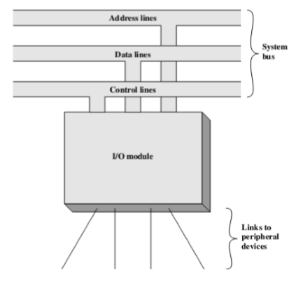

3. **I/O Module** is a bridge between **internal system** and **peripherals**
    + 键盘不是I/O模块，插入的部分是I/O模块

## 3.1. Interface to Peripheral 到外部设备的接口
1. The interface to the I/O module is in the form of control, data, and status signals I/O模块的接口以控制、数据和状态信号的形式
2. Control logic associated with the device controls the device’s operation in response to direction from the I/O module 与设备相关联的控制逻辑根据来自输入/输出模块的方向控制设备的操作
3. Buffer is associated with the transducer to temporarily hold data being transferred between the I/O module and the external environment with size of 8 to 16 bits 缓冲器与传感器相关联，用于临时保存在输入/输出模块和外部环境之间传输的8至16位数据

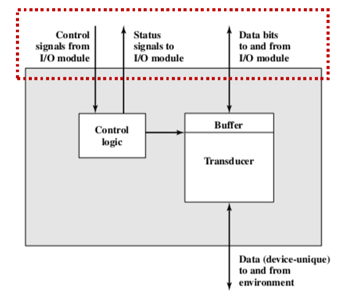

4. 状态是外设告知计算机的，控制信号是计算机给外设的，数据可以是双方交互的。

## 3.2. I/O Module Functions I/O模块的作用

### 3.2.1. Processor communication 处理器交互
1. Command decoding: I/O module accepts commands from the processor, typically sent as signals on the control bus 命令解码：I/O模块接受来自处理器的命令，通常作为控制总线上的信号发送
2. Data: data are exchanged between processor and I/O module over data bus 数据：数据通过数据总线在处理器和I/O模块之间交换
3. Status reporting: for peripherals are so slow, it is important to know the status of the I/O module 状态报告：对于速度非常慢的外围设备，了解I/O模块的状态非常重要
4. Address recognition: I/O module must recognize one unique address for each peripheral it controls 地址识别：I/O模块必须为其控制的每个外围设备识别一个唯一的地址

### 3.2.2. Device communication 设备交互
>涉及以下三种
1. commands 命令
2. status information 状态信息
3. data 数据
 
### 3.2.3. Control and timing 控制和定时
1. Processor communicates with external devices in unpredictable patterns 处理器以不可被预知的模式与外部设备通信
2. Internal resources, such as memory and system bus, are shared 内存和系统总线等内部资源是共享的
3. Example: transfer of data from external device to processor 示例：将数据从外部设备传输到处理器
    1. Processor interrogates I/O module to check the device status 处理器询问I/O模块以检查设备状态
    2. I/O module returns the device status I/O模块返回设备状态
    3. If prepared, processor requests the transfer of data, by means of a command to I/O module 如果准备好了，处理器通过命令向I/O模块请求数据传输
    4. I/O module obtains a unit of data from the external device I/O模块从外部设备获取数据单位
    5. Data are transferred from I/O module to processor 数据从I/O模块传输到处理器

### 3.2.4. Data buffering 数据缓冲
1. Transfer rate into and out of main memory or processor is quite high 进出主存或处理器的传输速率相当高
2. Transfer rate is orders of magnitude lower for many peripheral devices and covers a wide range 对于许多外围设备来说，传输速率要低几个数量级，而且覆盖范围很广

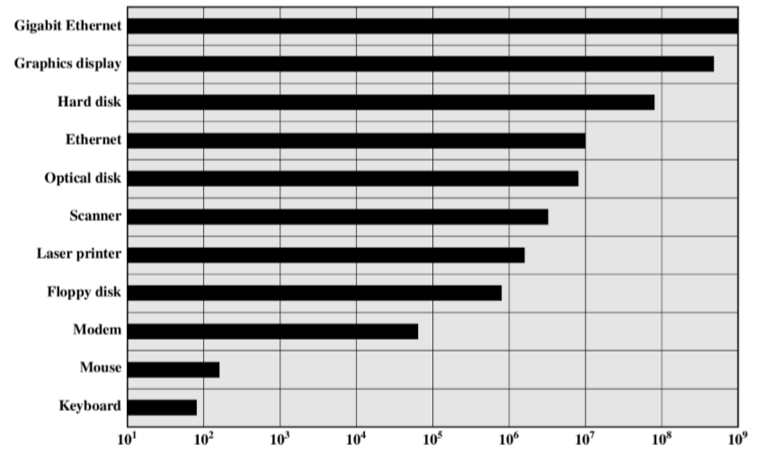

### 3.2.5. Error detection 错误探测
1. Detect errors and report errors to processor 检查错误，并且报告错误给处理器
2. Error type 错误类型
    1. Mechanical and electrical malfunctions reported by the device 设备报告的机械和电气故障(硬件错误)
    2. Unintentional changes to the bit pattern in transfer 传输中对位模式的无意更改(就是奇偶校验法校验的位)

# 4. I/O Module Structure
1. 红色的是对计算机系统内部的接口
2. 蓝色的是对计算机系统外部的接口

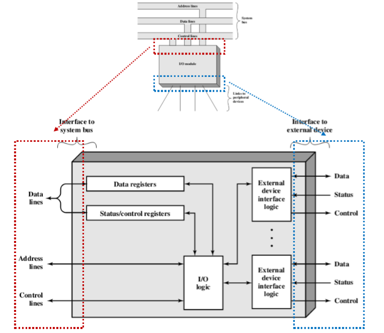

3. registers表示不止一个，超过一个。
4. 状态/控制寄存器是放置磁道多少、读多少等信息(一些参数的存储)

## 4.1. External Interface 外部接口
1. For parallel interface requires timing on each time, the bus clock frequency is limited when the transfer speed and bus length increase 由于并行接口要求每次定时，当传输速度和总线长度增加时，总线时钟频率受到限制
2. 如果总线长度增加，那么在总线上的传输时间就不可以被忽略，所以会造成总线频率震动

### 4.1.1. 并行接口 Parallel interface:
1. there are multiple lines connecting I/O module and the peripheral, and multiple bits are transferred simultaneously, just as all of the bits of a word are transferred simultaneously over the data bus 有多条线路连接I/O模块和外围设备，同时传输多个位，就像一个字的所有位通过数据总线同时传输一样

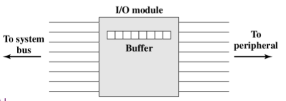

### 4.1.2. 串行接口 Serial interface: 
1. there is only one line used to transmit data, and bits must be transmitted one at a time 只有一条线路用于传输数据，每次必须传输一个位

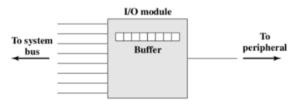

2. 为什么目前多用**串行总线**？
    1. 并行总线对于时钟要求高，并且数据线长度不能太长。时钟漂移(时间对不齐会出问题)带来问题
    2. 便宜:如果使用并行总线，那么每根线之间需要防止串线。

# 5. I/O Operation Technique I/O 操作技术
1. Programmed I/O(编程式): when transfer data, processor executes a program that gives it direct control of the I/O operation, and wait until the I/O operation is complete 当传输数据时，处理器执行一个程序，该程序直接控制I/O操作，并等待I/O操作完成
2. Interrupt-driven I/O(中断驱动式): processor issues an I/O command, continues to execute other instructions, and is interrupted by the I/O module when the latter has completed its work 处理器发出一个I/O命令，继续执行其他指令，当I/O模块完成工作时中断
3. Direct memory access(DMA): I/O module and main memory exchange data directly, without processor involvement I/O模块和主存直接交换数据，无需处理器参与

## 5.1. Programmed I/O 编程式 I/O
1. When processor is executing a program and encounters an instruction relating to I/O, it executes that instruction by issuing a command to the appropriate I/O module 当处理器执行一个程序并遇到一个与I/O有关的指令时，它通过向适当的I/O模块发出一个命令来执行该指令
2. I/O module will perform the requested action and then set the appropriate bits in the I/O status register I/O模块将执行请求的操作，然后在I/O状态寄存器中设置适当的位
3. I/O module does not interrupt processor, so it is the responsibility of processor periodically to check the status of I/O module until it finds that the operation is complete I/O模块不会中断处理器，因此处理器有责任定期检查I/O模块的状态，直到发现操作完成为止
4. 是I/O处理部分中唯一不产生中断的部分

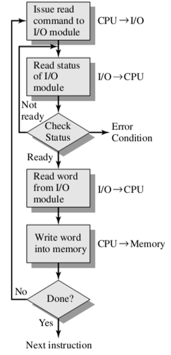

4. Check Status表示确认状态
    1. 一个是为未准备好
    2. 另一个是出现了其他错误
5. 问题:只要有I/O操作，cpu就**一直要忙**，过程参考右侧小字
    + 也就是意味着I/O占用率会比较高

### 5.1.1. I/O Command I/O命令
1. To execute an I/O-related instruction, the processor issues an address, specifying the particular I/O module and external device, and an I/O command 为了执行与I/O相关的指令，处理器发出一个地址，指定特定的I/O模块和外部设备，以及一个I/O命令
2. Type
    1. Control: activate a peripheral and tell it what to do 控制：激活外设并告诉它该做什么
    2. Test: test various status conditions associated with an I/O module and its peripherals 测试：测试与I/O模块及其外围设备相关的各种状态条件
    3. Read: cause I/O module to obtain an item of data from the peripheral and place it in an internal buffer 读取：使I/O模块从外设获取一项数据并将其放入内部缓冲区
    4. Write: cause the I/O module to take an item of data from the data bus and subsequently transmit that data item to the peripheral 写入：使I/O模块从数据总线获取一项数据，然后将该数据项传输到外围设备

### 5.1.2. I/O Instruction I/O指令
1. I/O instructions are easily mapped into I/O commands, and there is often a simple one-to-one relationship I/O指令很容易映射到I/O命令中，并且通常有一个简单的一对一关系
    + The form of the instruction depends on the way in which external devices are addressed 指令的形式取决于外部设备的寻址方式
2. Addressing
    1. Memory-mapped I/O: a single address space for memory locations and I/O devices 内存映射I/O：用于内存位置和I/O设备的单个地址空间
        + Large repertoire of instructions can be used, allowing more efficient programming 可以使用大量指令，从而实现更高效的编程
        + 坏处:这样子牺牲了一部分的内存空间
    2. Isolated I/O: equipped with memory read and write plus input and output command lines 隔离I/O：配备存储器读写和输入输出命令行
        + 使用一些比较专用的命令
3. **和I/O相关的指令是I/O指令，I/O命令一般对应一个I/O指令，I/O命令比I/O指令少一个地址**

## 5.2. Interrupt Driven I/O 中断驱动式的I/O
1. Processor issues an I/O command to a module and then go on to do some other useful work 处理器向一个模块发出一个I/O命令，然后继续做一些其他有用的工作
2. I/O module interrupts the processor to request service, when it is ready to exchange data with the processor 当处理器准备好与处理器交换数据时，I/O模块中断处理器以请求服务
3. Processor executes data transfer, and then resumes its former processing 处理器执行数据传输，然后恢复以前的处理

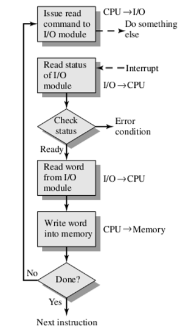

4. 注意右侧小字:可以发现cpu可以去做一些其他的事情。

### 5.2.1. View point of I/O module 从I/O模块看
1. For input, I/O module receives a READ command from the processor 对于输入，I/O模块从处理器中接收到读命令。
2. I/O module proceeds to read data in from an associated peripheral I/O模块继续从相关外围设备读取数据。
3. Once the data are in the module’s data register, I/O module signals an interrupt to the processor over a control line 一旦数据进入模块的数据寄存器，I/O模块通过控制线向处理器发送**中断信号**
4. I/O module waits until its data are requested by the processor I/O模块等待处理器请求其数据
5. When the request is made, I/O module places its data on the data bus and is then ready for another I/O operation 当发出请求时，I/O模块将其数据放在数据总线上，然后准备进行另一个I/O操作

### 5.2.2. View point of processor 从处理器角度
1. Processor issues a READ command 处理器发出读取命令
2. Processor goes off and does something else, and checks for interrupts at the end of each instruction cycle 处理器关闭并执行其他操作，并在每个指令周期结束时检查中断
3. When the interrupt from I/O module occurs, processor saves the context of the current program 当I/O模块发生中断时，**处理器保存当前程序的上下文**
4. Processor reads the word of data from I/O module and stores it in memory 处理器从I/O模块读取数据字并将其存储在存储器中
5. Processor restores the context of the program it was working on (or some other program) and resumes execution 处理器恢复正在运行的程序（或其他程序）的上下文并继续执行

### 5.2.3. Device Identification 设备确认
1. Multiple interrupt lines 多条中断线
    + Even if multiple lines are used, one of the other three techniques must be used on each line 即使使用多行，也必须在每行上使用其他三种技术之一
2. Software poll 软件轮询
    + Processor checks the address of each I/O module in turn 处理器依次检查每个I/O模块的地址
3. Daisy chain (vectored interrupt) 链式(向量中断):向量表示的是这个硬件设备的编号
    + All I/O modules share a common interrupt request line, and the interrupt acknowledge line is daisy chained through the modules 所有I/O模块共享一条公共中断请求线，中断确认线通过模块菊花链连接，许可的方式
    + **为什么不可以直接报号?因为一个时刻可能不止一个设备在请求**:也就是意味着存在多个设备抢总线的情况
4. Independent request (vectored interrupt)独立请求 向量中断
    + A specific interrupt controller is used to analyze priorities and decoding 一个特定的**中断控制器**来分析优先级和解码，也就是增加了运算量的问题。
    + 依旧也会涉及到向量(编号)

### 5.2.4. Assigning Priority 优先级问题
1. Multiple interrupt lines: processor picks the interrupt line with the highest priority 多中断线：处理器选择优先级最高的中断线
2. Software poll: the order in which modules are polled determines their priority 软件轮询:模块的轮询顺序决定了它们的优先级
3. Daisy chain: the order of modules determines their priority 菊花链:模块的顺序决定了它们的优先级
4. Independent request : the interrupt controller determines 独立请求:由控制器决定谁进行中断。
5. 设置两个优先级来进行处理:**响应优先级、处理优先级**
    + 防止有比较严重的情况
    + 我们要这么理解响应优先级和处理优先级:也就是说我们不得不注意到，永远是响应优先级高的优先占用到总线，之后是根据是否有处理优先级更高的部分需要被处理来决定是否优先处理另一部分。

### 5.2.5. Interrupts Enabled and Disabled(开关中断)
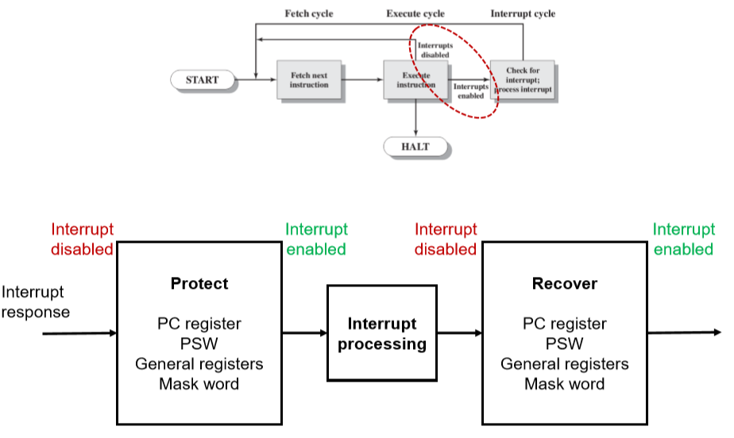

1. 为什么要有从Execute instruction到前面的箭头?
    + 因为有开关中断:也就是说这个时候的终端未必可以被响应
2. 中断要把所有的上下文环境放置到栈中。
3. 为什么会有开关中断?
    + 因为有些操作不可以被打断，比如绿字中的部分不可以被关闭:比如有些正在处理中关于数据读取等操作不可以被直接打断。

### 5.2.6. Response Priority and Processing Priority 响应优先级以及处理优先级
1. 例子如下：
2. Assume there are 4 interrupt sources in an interrupt system, whose **response priorities** are L1>L2>L3>L4 and **processing priorities** are L1>L4>L3>L2. If the L1, L3 and L4 interrupts occur at the same time when the main program executes, and L2 interrupt occurs in the procedure of processing L3 interrupt, write the **mask words(屏蔽字)** and the procedure of all interrupt service programs. 我们假设在中断系统中一共有4种终端设备，他们的响应优先级为L1>L2>L3>L4，并且处理优先级为L1>L4>L3>L2,假设L1、L3、L4在主程序运行的时候同时发生了中断请求，而L2的中断请求发生在处理L3中断的时候，请写出当前中断处理程序的过程以及屏蔽字。

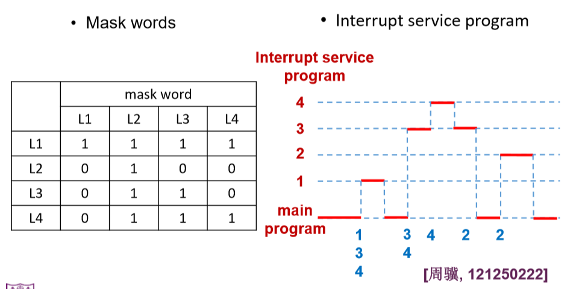

3. 屏蔽字是由处理优先级来进行处理的
    + 每一个都能屏蔽自己:因为处理优先级不高所以可以屏蔽自己
    + 如上的屏蔽字中，行屏蔽列
4. 例子:抢座位，年轻人先抢到**坐下**(响应优先级高),老太太比较慢(响应优先级低)，但是处理优先级高，所以年轻人会站起来，把座位留给老太太
    + 所以年轻人代表的程序段在栈中留下了痕迹，意味着这部分程序段并没有出栈，而仅仅是在栈中还没被处理
5. 第二个原则:从哪里来到哪里去，先回到主程序。
6. 考试的话:要写好每一个步骤，算分从第一个错误的开始算。

# 6. Direct Memory Access 直接内存访问
1. DMA的初始化比较耗时，因为需要获知具体的操作信息。

## 6.1. problem DMA存在的问题
1. I/O transfer rate is limited by the speed with which processor can test and service a device I/O传输速率受处理器测试和服务设备的速度限制
2. Processor is tied up in managing an I/O transfer; a number of instructions must be executed for each I/O transfer 处理器在管理I/O传输时被束缚；每个I/O传输都必须执行许多指令

## 6.2. DMA
1. A module for direct memory access without going through processor 一种不经过处理器直接存取存储器的模块

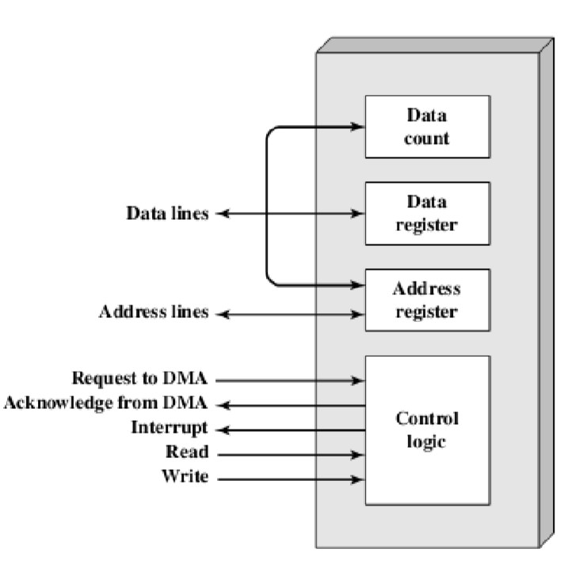

2. Processor issues a command to the DMA module by sending the following information: read/write, I/O device address, starting location in memory, number of words 处理器通过发送以下信息向DMA模块发出命令：读/写、I/O设备地址、内存中的起始位置、字数
3. Processor continues with other work 处理器继续其他工作，从而保证了处理器可以被相对更少的占用。
4. DMA module transfers the entire block of data, one word at a time, directly to or from memory, without going through processor DMA模块在不经过处理器的情况下，将**整个数据块一次一个字**直接传送到存储器或从存储器中传送出去
5. When the transfer is complete, DMA module sends an interrupt signal to processor 当传输完成时，DMA模块向处理器发送一个中断信号
6. 在这个过程中，CPU和DMA会访问内存，这时候会出现冲突。CPU和DMA发生冲突时，**DMA优先级高**
    + 因为DMA连接的是比较高速的I/O设备，如果不及时相应，则容易**数据溢出**。

## 6.3. Memory Access 内存权限

### 6.3.1. Stop CPU 停止CPU
1. Advantage: simple in control 控制简单
2. Disadvantage: influence CPU, not make full use of memory 影响CPU，对于内存的使用不充分
3. Suitable: block transfer by high speed I/O device 高速I/O设备的块传输

4. 这种情况不常用:他是直接停止了CPU对于其他部分的处理

### 6.3.2. Cycle stealing 周期窃取
1. Advantage: make full use of CPU and memory, and response I/O request in time 充分利用CPU和内存，及时响应I/O请求
2. Disadvantage: DMA should request bus each time DMA应每次请求总线
3. Suitable: I/O cycle is larger than memory cycle **I/O周期大于内存周期**

4. CPU用着，DMA使用则进行使用

### 6.3.3. Alternate (time sharing) access 共享权限
1. Advantage: CPU is not stopped or waited, and DMA doesn’t request bus CPU未停止或等待，DMA未请求总线
2. Suitable: CPU cycle is larger than memory cycle 适用：**CPU周期大于内存周期**

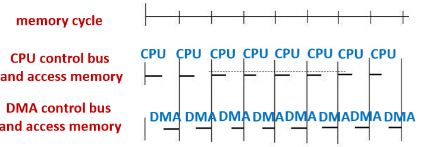

3. 这种情况比较少:简单来看就是讲一个时钟周期加细。

## 6.4. Connection 连接

### 6.4.1. DMA mechanism configuration DMA机制配置
1. Single-bus, detached DMA 一条总线，连接DMA
    + All modules share the same system bus 所有模块共享同一系统总线
    + DMA module uses programmed I/O to exchange data between memory and an I/O module through DMA module DMA模块使用编程的I/O通过DMA模块在存储器和I/O模块之间交换数据
    + Inexpensive but inefficient 便宜但是低效
2. Single-bus, integrated DMA-I/O 一条总线，整合了DMA和I/O
    + Besides system bus, there is a path between DMA module and one or more I/O modules 除了系统总线外，DMA模块和一个或多个I/O模块之间还有一条路径
    + DMA logic may actually be a part of an I/O module, or it may be a separate module that controls one or more I/O modules DMA逻辑实际上可以是I/O模块的一部分，也可以是控制一个或多个I/O模块的单独模块
    + Reduce the bus cycles 减少循环周期

3.  I/O bus 使用I/O总线
    + Connect I/O modules to the DMA module using an I/O bus 使用I/O总线将I/O模块连接到DMA模块
    + Reduce the number of I/O interfaces in DMA module to one and provides for an easily expandable configuration 将DMA模块中的I/O接口数量减少到1个，并提供易于扩展的配置

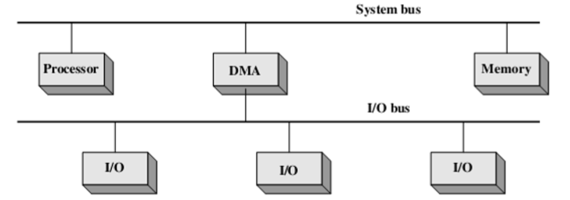

4. Example
    1. Assume the clock frequency of CPU is 500MHz; hard disk transfers data with 4 words block (32 bits per words), and the transfer speed is 32Mbps 假设CPU的时钟频率为500MHz，硬盘以4字块（32位/字）传输数据，传输速度为32Mbps
    2. If use interrupt driven I/O, each block transfer requires 500 clock cycles (including interrupt response and processing), what the time percentage does CPU use in hard disk I/O? 如果使用中断驱动的I/O，每个块传输需要500个时钟周期（包括中断响应和处理），CPU在硬盘I/O中使用的时间百分比是多少？
        + Interrupt number per second: 32Mb(32,000,000b) / 16B(128b) = 250K
        + Cycle number per second: 250K * 500 = 125M
        + CPU time percentage: 125M / 500M = 25%
    3. If use DMA, CPU requires 1000 clock cycles for DMA transfer initialization, and 500 clock cycles for interrupt processing after transfer. If 8KB data can be transferred in each DMA transfer, what the time percentage does CPU use in hard disk I/O? 如果使用DMA，CPU需要1000个时钟周期用于DMA传输初始化，500个时钟周期用于传输后的中断处理。如果在每次DMA传输中可以传输8KB数据，那么CPU在硬盘I/O中使用的时间百分比是多少？
        + Time for each DMA transfer: 8KB / 32Mbps = 2ms
        + DMA transfer number per second: 1s / 2ms = 500
        + Cycle number per second: (1000 + 500) * 500 = 750K
        + CPU time percentage: 750K / 500M = 0.15%

## 6.5. Hard Disk Access
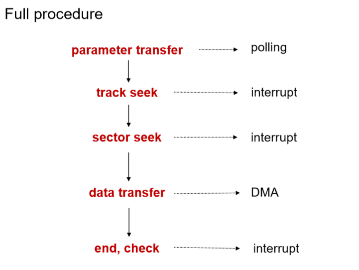

# 7. Evolutionary of I/O Module I/O 模块的发展进程
1. CPU directly controls a peripheral device(最开始 CPU 直接控制了外设)
2. A controller or I/O module is added, and CPU uses programmed I/O without interrupts (divorce CPU from external device details) 添加了控制器或I/O模块，CPU使用编程的I/O而不中断（CPU与外部设备细节分离）
3. Interrupts are employed (CPU need not spend time waiting for an I/O operation to be performed) 使用中断（CPU无需花费时间等待执行I/O操作）
4. I/O module is given direct access to memory via DMA (move a block of data to or from memory without involving the CPU, except at the beginning and end of the transfer) I/O模块可以通过DMA直接访问内存（在不涉及CPU的情况下将数据块移动到内存或从内存中移动数据块，传输的开始和结束时除外）
5. **I/O channel(I/O 通道)**: I/O module has its own processor, with a specialized instruction set tailored for I/O (CPU directs I/O processor to execute an I/O program in memory, and it is interrupted only when the entire sequence has been performed) I/O模块有自己的处理器，有专门为I/O定制的指令集（CPU指示I/O处理器在内存中执行I/O程序，只有在执行了整个序列时才会中断）
    + 多了processor
6. **I/O processor(I/O 处理机)**: I/O module has a local memory (a large set of I/O devices can be controlled, with minimal CPU involvement) I/O模块有一个本地存储器（可以控制一大组I/O设备，只需占用很少的CPU）
    + 多了内存
